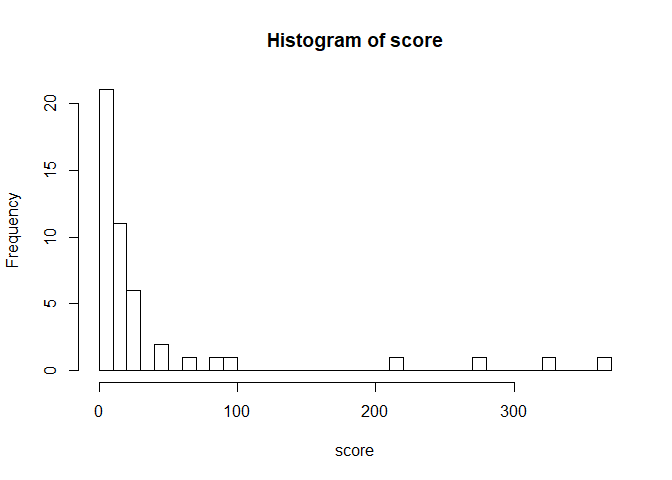

Team mTurk - Image Bounding Scoring
================

``` r
# Read in the correct bounding cooridinates
pilot_d <- fread("../data/experiment_1/experiment_1_results.csv")

# Remove bad image where bounding box not available
pilot_d <- pilot_d[ImageId != "https://kstonedev.s3-us-west-2.amazonaws.com/W241/openimages/104b3a47edc67285.jpg",]
pilot_d <- pilot_d[ImageId != "https://kstonedev.s3-us-west-2.amazonaws.com/W241/openimages/1002f337f91b7932.jpg",]
pilot_d <- pilot_d[ImageId != "https://kstonedev.s3-us-west-2.amazonaws.com/W241/openimages/1271622877a21c47.jpg",]


pilot_d[, log_bounding_box_score := log(bounding_box_score)]


head(pilot_d)
```

    ##    top bottom right left                          HITId
    ## 1: 435    578   544  152 37SDSEDIOCKDFHIRHX0KAUZPJK081M
    ## 2: 428    579   545  146 37SDSEDIOCKDFHIRHX0KAUZPJK081M
    ## 3: 405    595   556  135 37SDSEDIOCKDFHIRHX0KAUZPJK081M
    ## 4: 385    622   584  120 37SDSEDIOCKDFHIRHX0KAUZPJK081M
    ## 5: 425    580   543  146 37SDSEDIOCKDFHIRHX0KAUZPJK081M
    ## 6: 416    577   546  145 37SDSEDIOCKDFHIRHX0KAUZPJK081M
    ##                         HITTypeId Reward AssignmentDurationInSeconds
    ## 1: 3VMQHMXNFYY535P7V0MRNN4HN3BPRU  $0.20                        3600
    ## 2: 3VMQHMXNFYY535P7V0MRNN4HN3BPRU  $0.20                        3600
    ## 3: 3VMQHMXNFYY535P7V0MRNN4HN3BPRU  $0.20                        3600
    ## 4: 3VMQHMXNFYY535P7V0MRNN4HN3BPRU  $0.20                        3600
    ## 5: 3VMQHMXNFYY535P7V0MRNN4HN3BPRU  $0.20                        3600
    ## 6: 3VMQHMXNFYY535P7V0MRNN4HN3BPRU  $0.20                        3600
    ##          WorkerId AssignmentStatus LifetimeApprovalRate
    ## 1: A182N7RLXGSCZG        Submitted             0% (0/0)
    ## 2: A1LITXPXO6OBB8        Submitted             0% (0/0)
    ## 3:  A2OP2ZANIM5ZV        Submitted             0% (0/0)
    ## 4: A21XECECA39A7I        Submitted             0% (0/0)
    ## 5: A2OFJ6VNONYVK7        Submitted             0% (0/0)
    ## 6: A10BX5AD14TGMB        Submitted             0% (0/0)
    ##    Last30DaysApprovalRate Last7DaysApprovalRate WorkTimeInSeconds
    ## 1:               0% (0/0)              0% (0/0)                45
    ## 2:               0% (0/0)              0% (0/0)                70
    ## 3:               0% (0/0)              0% (0/0)               103
    ## 4:               0% (0/0)              0% (0/0)               108
    ## 5:               0% (0/0)              0% (0/0)               109
    ## 6:               0% (0/0)              0% (0/0)               114
    ##                                                                              ImageId
    ## 1: https://kstonedev.s3-us-west-2.amazonaws.com/W241/openimages/116257e7260fdb51.jpg
    ## 2: https://kstonedev.s3-us-west-2.amazonaws.com/W241/openimages/116257e7260fdb51.jpg
    ## 3: https://kstonedev.s3-us-west-2.amazonaws.com/W241/openimages/116257e7260fdb51.jpg
    ## 4: https://kstonedev.s3-us-west-2.amazonaws.com/W241/openimages/116257e7260fdb51.jpg
    ## 5: https://kstonedev.s3-us-west-2.amazonaws.com/W241/openimages/116257e7260fdb51.jpg
    ## 6: https://kstonedev.s3-us-west-2.amazonaws.com/W241/openimages/116257e7260fdb51.jpg
    ##    in_treatment bound_size bounding_box_score log_bounding_box_score
    ## 1:            0   63188.64          20.164618               3.003929
    ## 2:            0   63188.64           7.328206               1.991731
    ## 3:            0   63188.64          38.443185               3.649181
    ## 4:            0   63188.64         102.597284               4.630811
    ## 5:            0   63188.64           4.743881               1.556856
    ## 6:            0   63188.64          12.437924               2.520750

``` r
worker_mean_score <- pilot_d[, .(score = mean(bounding_box_score), log_score = mean(log_bounding_box_score), in_treatment = as.integer(median(in_treatment))), keyby=WorkerId]

worker_mean_score[, plot(score, col=(in_treatment+1))]
```

<!-- -->

    ## NULL

``` r
worker_mean_score[, plot(log_score, col=c("black", "red")[in_treatment+1])]
```

<!-- -->

    ## NULL

``` r
worker_mean_score[in_treatment==0, hist(score, breaks=30)]
```

<!-- -->

    ## $breaks
    ##  [1]   0  10  20  30  40  50  60  70  80  90 100 110 120 130 140 150 160
    ## [18] 170 180 190 200 210 220 230 240 250
    ## 
    ## $counts
    ##  [1] 23 13  4  2  1  2  0  0  1  1  1  0  0  0  0  0  0  0  0  0  0  1  0
    ## [24]  0  1
    ## 
    ## $density
    ##  [1] 0.046 0.026 0.008 0.004 0.002 0.004 0.000 0.000 0.002 0.002 0.002
    ## [12] 0.000 0.000 0.000 0.000 0.000 0.000 0.000 0.000 0.000 0.000 0.002
    ## [23] 0.000 0.000 0.002
    ## 
    ## $mids
    ##  [1]   5  15  25  35  45  55  65  75  85  95 105 115 125 135 145 155 165
    ## [18] 175 185 195 205 215 225 235 245
    ## 
    ## $xname
    ## [1] "score"
    ## 
    ## $equidist
    ## [1] TRUE
    ## 
    ## attr(,"class")
    ## [1] "histogram"

``` r
worker_mean_score[in_treatment==1, hist(score, breaks=30)]
```

    ## $breaks
    ##  [1]   0  10  20  30  40  50  60  70  80  90 100 110 120 130 140 150 160
    ## [18] 170 180 190 200 210 220 230 240 250 260 270 280 290 300 310 320 330
    ## [35] 340 350 360 370
    ## 
    ## $counts
    ##  [1] 21 11  6  0  2  0  1  0  1  1  0  0  0  0  0  0  0  0  0  0  0  1  0
    ## [24]  0  0  0  0  1  0  0  0  0  1  0  0  0  1
    ## 
    ## $density
    ##  [1] 0.044680851 0.023404255 0.012765957 0.000000000 0.004255319
    ##  [6] 0.000000000 0.002127660 0.000000000 0.002127660 0.002127660
    ## [11] 0.000000000 0.000000000 0.000000000 0.000000000 0.000000000
    ## [16] 0.000000000 0.000000000 0.000000000 0.000000000 0.000000000
    ## [21] 0.000000000 0.002127660 0.000000000 0.000000000 0.000000000
    ## [26] 0.000000000 0.000000000 0.002127660 0.000000000 0.000000000
    ## [31] 0.000000000 0.000000000 0.002127660 0.000000000 0.000000000
    ## [36] 0.000000000 0.002127660
    ## 
    ## $mids
    ##  [1]   5  15  25  35  45  55  65  75  85  95 105 115 125 135 145 155 165
    ## [18] 175 185 195 205 215 225 235 245 255 265 275 285 295 305 315 325 335
    ## [35] 345 355 365
    ## 
    ## $xname
    ## [1] "score"
    ## 
    ## $equidist
    ## [1] TRUE
    ## 
    ## attr(,"class")
    ## [1] "histogram"

``` r
library(Hmisc)
```

    ## Warning: package 'Hmisc' was built under R version 3.5.3

    ## Loading required package: lattice

    ## Loading required package: survival

    ## Loading required package: Formula

    ## Warning: package 'Formula' was built under R version 3.5.2

    ## Loading required package: ggplot2

    ## Warning: package 'ggplot2' was built under R version 3.5.3

    ## 
    ## Attaching package: 'Hmisc'

    ## The following objects are masked from 'package:dplyr':
    ## 
    ##     src, summarize

    ## The following objects are masked from 'package:base':
    ## 
    ##     format.pval, units

<!-- -->

``` r
summary(pilot_d[, ])
```

    ##       top            bottom          right            left      
    ##  Min.   :357.0   Min.   :382.0   Min.   :105.0   Min.   : 27.0  
    ##  1st Qu.:418.0   1st Qu.:578.0   1st Qu.:543.0   1st Qu.:140.0  
    ##  Median :425.0   Median :581.0   Median :545.0   Median :144.0  
    ##  Mean   :421.6   Mean   :579.2   Mean   :540.4   Mean   :149.3  
    ##  3rd Qu.:428.0   3rd Qu.:585.0   3rd Qu.:550.0   3rd Qu.:146.0  
    ##  Max.   :516.0   Max.   :657.0   Max.   :657.0   Max.   :624.0  
    ##  NA's   :3       NA's   :3       NA's   :3       NA's   :3      
    ##     HITId            HITTypeId            Reward         
    ##  Length:105         Length:105         Length:105        
    ##  Class :character   Class :character   Class :character  
    ##  Mode  :character   Mode  :character   Mode  :character  
    ##                                                          
    ##                                                          
    ##                                                          
    ##                                                          
    ##  AssignmentDurationInSeconds   WorkerId         AssignmentStatus  
    ##  Min.   :3600                Length:105         Length:105        
    ##  1st Qu.:3600                Class :character   Class :character  
    ##  Median :3600                Mode  :character   Mode  :character  
    ##  Mean   :3600                                                     
    ##  3rd Qu.:3600                                                     
    ##  Max.   :3600                                                     
    ##                                                                   
    ##  LifetimeApprovalRate Last30DaysApprovalRate Last7DaysApprovalRate
    ##  Length:105           Length:105             Length:105           
    ##  Class :character     Class :character       Class :character     
    ##  Mode  :character     Mode  :character       Mode  :character     
    ##                                                                   
    ##                                                                   
    ##                                                                   
    ##                                                                   
    ##  WorkTimeInSeconds   ImageId           in_treatment      bound_size   
    ##  Min.   :  43.0    Length:105         Min.   :0.0000   Min.   :63189  
    ##  1st Qu.: 162.0    Class :character   1st Qu.:0.0000   1st Qu.:63189  
    ##  Median : 273.0    Mode  :character   Median :1.0000   Median :63189  
    ##  Mean   : 411.7                       Mean   :0.5048   Mean   :63189  
    ##  3rd Qu.: 514.0                       3rd Qu.:1.0000   3rd Qu.:63189  
    ##  Max.   :2017.0                       Max.   :1.0000   Max.   :63189  
    ##                                                                       
    ##  bounding_box_score log_bounding_box_score
    ##  Min.   :  2.250    Min.   :0.811         
    ##  1st Qu.:  6.684    1st Qu.:1.900         
    ##  Median : 10.881    Median :2.387         
    ##  Mean   : 46.555    Mean   :2.735         
    ##  3rd Qu.: 23.615    3rd Qu.:3.162         
    ##  Max.   :652.135    Max.   :6.480         
    ##  NA's   :3          NA's   :3

``` r
pilot_d[, mean(bounding_box_score, na.rm=T), keyby=in_treatment]
```

    ##    in_treatment       V1
    ## 1:            0 35.18773
    ## 2:            1 58.37779

``` r
#mod <- pilot_d[bounding_box_score < 50, lm(bounding_box_score ~ in_treatment+bound_size)]
mod <- pilot_d[, lm(bounding_box_score ~ in_treatment)]
summary(mod)
```

    ## 
    ## Call:
    ## lm(formula = bounding_box_score ~ in_treatment)
    ## 
    ## Residuals:
    ##    Min     1Q Median     3Q    Max 
    ## -55.99 -46.40 -28.54 -16.68 593.76 
    ## 
    ## Coefficients:
    ##              Estimate Std. Error t value Pr(>|t|)  
    ## (Intercept)     35.19      15.94   2.207   0.0296 *
    ## in_treatment    23.19      22.77   1.018   0.3109  
    ## ---
    ## Signif. codes:  0 '***' 0.001 '**' 0.01 '*' 0.05 '.' 0.1 ' ' 1
    ## 
    ## Residual standard error: 115 on 100 degrees of freedom
    ##   (3 observations deleted due to missingness)
    ## Multiple R-squared:  0.01027,    Adjusted R-squared:  0.0003691 
    ## F-statistic: 1.037 on 1 and 100 DF,  p-value: 0.3109

``` r
#t.test(pilot_d[in_treatment == 1, bounding_box_score], pilot_d[in_treatment == 0, bounding_box_score])
```

``` r
mod <- pilot_d[, lm(bounding_box_score ~ WorkTimeInSeconds)]
summary(mod)
```

    ## 
    ## Call:
    ## lm(formula = bounding_box_score ~ WorkTimeInSeconds)
    ## 
    ## Residuals:
    ##    Min     1Q Median     3Q    Max 
    ## -65.46 -39.45 -35.03 -19.51 609.50 
    ## 
    ## Coefficients:
    ##                   Estimate Std. Error t value Pr(>|t|)  
    ## (Intercept)       39.89623   16.90958   2.359   0.0202 *
    ## WorkTimeInSeconds  0.01593    0.02982   0.534   0.5944  
    ## ---
    ## Signif. codes:  0 '***' 0.001 '**' 0.01 '*' 0.05 '.' 0.1 ' ' 1
    ## 
    ## Residual standard error: 115.4 on 100 degrees of freedom
    ##   (3 observations deleted due to missingness)
    ## Multiple R-squared:  0.002845,   Adjusted R-squared:  -0.007126 
    ## F-statistic: 0.2854 on 1 and 100 DF,  p-value: 0.5944

``` r
pilot_d[, mean(WorkTimeInSeconds, na.rm=T), keyby=in_treatment]
```

    ##    in_treatment       V1
    ## 1:            0 410.0000
    ## 2:            1 413.3019

``` r
mod <- pilot_d[, lm(WorkTimeInSeconds ~ in_treatment)]
summary(mod)
```

    ## 
    ## Call:
    ## lm(formula = WorkTimeInSeconds ~ in_treatment)
    ## 
    ## Residuals:
    ##    Min     1Q Median     3Q    Max 
    ## -370.3 -248.0 -139.3  100.7 1603.7 
    ## 
    ## Coefficients:
    ##              Estimate Std. Error t value Pr(>|t|)    
    ## (Intercept)   410.000     53.230   7.702 8.55e-12 ***
    ## in_treatment    3.302     74.923   0.044    0.965    
    ## ---
    ## Signif. codes:  0 '***' 0.001 '**' 0.01 '*' 0.05 '.' 0.1 ' ' 1
    ## 
    ## Residual standard error: 383.8 on 103 degrees of freedom
    ## Multiple R-squared:  1.886e-05,  Adjusted R-squared:  -0.00969 
    ## F-statistic: 0.001942 on 1 and 103 DF,  p-value: 0.9649

``` r
mod <- worker_mean_score[score < 100, lm(score ~ in_treatment)]
summary(mod)
```

    ## 
    ## Call:
    ## lm(formula = score ~ in_treatment)
    ## 
    ## Residuals:
    ##     Min      1Q  Median      3Q     Max 
    ## -15.737 -11.243  -7.536   1.813  77.648 
    ## 
    ## Coefficients:
    ##              Estimate Std. Error t value Pr(>|t|)    
    ## (Intercept)   17.2497     2.9563   5.835 8.79e-08 ***
    ## in_treatment   0.8794     4.2770   0.206    0.838    
    ## ---
    ## Signif. codes:  0 '***' 0.001 '**' 0.01 '*' 0.05 '.' 0.1 ' ' 1
    ## 
    ## Residual standard error: 20.27 on 88 degrees of freedom
    ## Multiple R-squared:  0.0004802,  Adjusted R-squared:  -0.01088 
    ## F-statistic: 0.04228 on 1 and 88 DF,  p-value: 0.8376

``` r
pilot_d[, mean(WorkTimeInSeconds)]
```

    ## [1] 411.6667

``` r
pilot_d[, .N, keyby=WorkerId]
```

    ##            WorkerId N
    ##   1: A10463CXXO00VE 1
    ##   2: A10BX5AD14TGMB 1
    ##   3: A10NBQP7W50X1I 2
    ##   4: A119XB4OETWU59 1
    ##   5: A11Q0SPI53J9DC 1
    ##   6: A134M46ZP1H02D 1
    ##   7: A154J6S2Z9BOKF 1
    ##   8: A16TEDRTHI8H9F 1
    ##   9: A182N7RLXGSCZG 1
    ##  10: A18EWG6CNKAO2J 1
    ##  11: A19Q990ORTCBN4 1
    ##  12: A1AWR7C38PW42P 1
    ##  13: A1BAT5O7WVAFPW 1
    ##  14: A1E6E0XZ1BX1AR 1
    ##  15: A1EA65VORB7TPU 1
    ##  16: A1EIMXVUOG49SJ 1
    ##  17: A1ESKJFDQUMBL4 1
    ##  18: A1FEQPNF3GMLG8 1
    ##  19: A1G10UPKNT2YEX 1
    ##  20: A1G7BBC1DT0YZ6 1
    ##  21: A1H8AABW86LBCO 1
    ##  22: A1LITXPXO6OBB8 1
    ##  23: A1MHQSP1POQNXX 1
    ##  24: A1NJQZGRNLH6RO 1
    ##  25: A1OCEC1TBE3CWA 1
    ##  26: A1QJFM0T6PHFD2 1
    ##  27: A1R7JSHFIWADMO 1
    ##  28: A1TQ7UQSSQP7BD 1
    ##  29: A1VXOAO2A1F74I 1
    ##  30: A1XBVNMQLREX5A 1
    ##  31: A20NUGCPGHLZGD 1
    ##  32: A20P4INLPHG8VA 1
    ##  33: A20TVQ2ZM7QWIP 1
    ##  34: A210WH51UY4KF1 1
    ##  35: A218BGZJ249RHB 1
    ##  36: A21XECECA39A7I 1
    ##  37: A225Z9CLP61ZJN 1
    ##  38: A23PA819AQYEV5 1
    ##  39: A25OEVVN0293PO 1
    ##  40: A25WGTFYA70QGZ 1
    ##  41: A279HK0GY9PIJ0 1
    ##  42: A27JY3V78RDGFY 1
    ##  43: A2A3U0GTJ7DK6Q 1
    ##  44: A2AKGKD22DWZHI 1
    ##  45: A2CA5NH50MKUPY 1
    ##  46: A2CYXHEA1EX07O 1
    ##  47: A2G44A4ZPWRPXU 1
    ##  48: A2GXKPQB64DZC1 1
    ##  49: A2MDORDGPI3WKR 1
    ##  50:  A2NAP4UHM4ALG 1
    ##  51: A2OFJ6VNONYVK7 1
    ##  52:  A2OP2ZANIM5ZV 1
    ##  53: A2QLZ92VQ01A4Q 1
    ##  54:  A2RCMJLGDWYFO 1
    ##  55: A2T3D68DRTSOTJ 1
    ##  56: A2UHK8HUXXMSVM 1
    ##  57: A2VIJIP92R2BWD 1
    ##  58: A2W32ASFEXZE5I 1
    ##  59: A2WEEHSZ6LRPIQ 1
    ##  60: A2WWMDOUR0HL4Q 2
    ##  61: A2WYGPR0ECWJFZ 1
    ##  62: A2X8VQ62EQADWD 1
    ##  63: A2ZSQLANLQ7OC6 1
    ##  64: A31Y7PAMZO5GVZ 1
    ##  65: A34A8A4MZ1V53Y 1
    ##  66: A366YWY1JQO4DH 1
    ##  67: A37YC7R1H04X9P 1
    ##  68: A3ABJN1IL7UCZ8 1
    ##  69: A3AHAY1VIJDCGX 2
    ##  70: A3AJE1ORZMFDON 1
    ##  71: A3BHKF9NJKCXPB 1
    ##  72: A3BIRWA8ZHZQSL 1
    ##  73: A3C5V0SNXXS5E7 1
    ##  74: A3DDWZOH9DPSP9 1
    ##  75: A3G5ZPURJ0XCBG 1
    ##  76: A3GNCNYVIN64OO 1
    ##  77: A3I7ZBU31VKOMC 1
    ##  78: A3KB2DY7SADI3Z 1
    ##  79: A3KOWY3F88WP94 1
    ##  80: A3KYQT21GQY4X0 1
    ##  81:  A3L3QOG7X0242 1
    ##  82: A3Q9UK9RCL87O8 1
    ##  83: A3R4SD33QQVAJX 2
    ##  84: A3VWU0WEB2VD48 1
    ##  85:  A4TQSZDPARE7I 1
    ##  86:  A6YCL762M6N74 1
    ##  87:  A8NMM0NXN9JIT 2
    ##  88:  A9LXSGXZM4IJE 1
    ##  89:  AAABU3NPTCTAR 1
    ##  90:  AAQGL7BD4ADZF 1
    ##  91:  AF3K80U0YQJMZ 1
    ##  92:  AI0FUDIB6LJ7S 1
    ##  93:  AKC5R24V6ZBRP 1
    ##  94:  AOQIN4AGBL85L 1
    ##  95:  ASBVFTDEA883R 1
    ##  96:  AWYK8MO0YQGXG 1
    ##  97:  AX1TWZNM2XLYO 1
    ##  98:  AXBFJUI5IFJX2 1
    ##  99:  AXPAQGAKQP558 1
    ## 100:   AZ6VY1EDA2WF 1
    ##            WorkerId N

``` r
pilot_d[, sum(in_treatment)]
```

    ## [1] 53

``` r
pilot_d[, mean(bounding_box_score), keyby=ImageId]
```

    ##                                                                              ImageId
    ## 1: https://kstonedev.s3-us-west-2.amazonaws.com/W241/openimages/116257e7260fdb51.jpg
    ##    V1
    ## 1: NA

``` r
pilot_d[, .N, keyby=WorkerId]
```

    ##            WorkerId N
    ##   1: A10463CXXO00VE 1
    ##   2: A10BX5AD14TGMB 1
    ##   3: A10NBQP7W50X1I 2
    ##   4: A119XB4OETWU59 1
    ##   5: A11Q0SPI53J9DC 1
    ##   6: A134M46ZP1H02D 1
    ##   7: A154J6S2Z9BOKF 1
    ##   8: A16TEDRTHI8H9F 1
    ##   9: A182N7RLXGSCZG 1
    ##  10: A18EWG6CNKAO2J 1
    ##  11: A19Q990ORTCBN4 1
    ##  12: A1AWR7C38PW42P 1
    ##  13: A1BAT5O7WVAFPW 1
    ##  14: A1E6E0XZ1BX1AR 1
    ##  15: A1EA65VORB7TPU 1
    ##  16: A1EIMXVUOG49SJ 1
    ##  17: A1ESKJFDQUMBL4 1
    ##  18: A1FEQPNF3GMLG8 1
    ##  19: A1G10UPKNT2YEX 1
    ##  20: A1G7BBC1DT0YZ6 1
    ##  21: A1H8AABW86LBCO 1
    ##  22: A1LITXPXO6OBB8 1
    ##  23: A1MHQSP1POQNXX 1
    ##  24: A1NJQZGRNLH6RO 1
    ##  25: A1OCEC1TBE3CWA 1
    ##  26: A1QJFM0T6PHFD2 1
    ##  27: A1R7JSHFIWADMO 1
    ##  28: A1TQ7UQSSQP7BD 1
    ##  29: A1VXOAO2A1F74I 1
    ##  30: A1XBVNMQLREX5A 1
    ##  31: A20NUGCPGHLZGD 1
    ##  32: A20P4INLPHG8VA 1
    ##  33: A20TVQ2ZM7QWIP 1
    ##  34: A210WH51UY4KF1 1
    ##  35: A218BGZJ249RHB 1
    ##  36: A21XECECA39A7I 1
    ##  37: A225Z9CLP61ZJN 1
    ##  38: A23PA819AQYEV5 1
    ##  39: A25OEVVN0293PO 1
    ##  40: A25WGTFYA70QGZ 1
    ##  41: A279HK0GY9PIJ0 1
    ##  42: A27JY3V78RDGFY 1
    ##  43: A2A3U0GTJ7DK6Q 1
    ##  44: A2AKGKD22DWZHI 1
    ##  45: A2CA5NH50MKUPY 1
    ##  46: A2CYXHEA1EX07O 1
    ##  47: A2G44A4ZPWRPXU 1
    ##  48: A2GXKPQB64DZC1 1
    ##  49: A2MDORDGPI3WKR 1
    ##  50:  A2NAP4UHM4ALG 1
    ##  51: A2OFJ6VNONYVK7 1
    ##  52:  A2OP2ZANIM5ZV 1
    ##  53: A2QLZ92VQ01A4Q 1
    ##  54:  A2RCMJLGDWYFO 1
    ##  55: A2T3D68DRTSOTJ 1
    ##  56: A2UHK8HUXXMSVM 1
    ##  57: A2VIJIP92R2BWD 1
    ##  58: A2W32ASFEXZE5I 1
    ##  59: A2WEEHSZ6LRPIQ 1
    ##  60: A2WWMDOUR0HL4Q 2
    ##  61: A2WYGPR0ECWJFZ 1
    ##  62: A2X8VQ62EQADWD 1
    ##  63: A2ZSQLANLQ7OC6 1
    ##  64: A31Y7PAMZO5GVZ 1
    ##  65: A34A8A4MZ1V53Y 1
    ##  66: A366YWY1JQO4DH 1
    ##  67: A37YC7R1H04X9P 1
    ##  68: A3ABJN1IL7UCZ8 1
    ##  69: A3AHAY1VIJDCGX 2
    ##  70: A3AJE1ORZMFDON 1
    ##  71: A3BHKF9NJKCXPB 1
    ##  72: A3BIRWA8ZHZQSL 1
    ##  73: A3C5V0SNXXS5E7 1
    ##  74: A3DDWZOH9DPSP9 1
    ##  75: A3G5ZPURJ0XCBG 1
    ##  76: A3GNCNYVIN64OO 1
    ##  77: A3I7ZBU31VKOMC 1
    ##  78: A3KB2DY7SADI3Z 1
    ##  79: A3KOWY3F88WP94 1
    ##  80: A3KYQT21GQY4X0 1
    ##  81:  A3L3QOG7X0242 1
    ##  82: A3Q9UK9RCL87O8 1
    ##  83: A3R4SD33QQVAJX 2
    ##  84: A3VWU0WEB2VD48 1
    ##  85:  A4TQSZDPARE7I 1
    ##  86:  A6YCL762M6N74 1
    ##  87:  A8NMM0NXN9JIT 2
    ##  88:  A9LXSGXZM4IJE 1
    ##  89:  AAABU3NPTCTAR 1
    ##  90:  AAQGL7BD4ADZF 1
    ##  91:  AF3K80U0YQJMZ 1
    ##  92:  AI0FUDIB6LJ7S 1
    ##  93:  AKC5R24V6ZBRP 1
    ##  94:  AOQIN4AGBL85L 1
    ##  95:  ASBVFTDEA883R 1
    ##  96:  AWYK8MO0YQGXG 1
    ##  97:  AX1TWZNM2XLYO 1
    ##  98:  AXBFJUI5IFJX2 1
    ##  99:  AXPAQGAKQP558 1
    ## 100:   AZ6VY1EDA2WF 1
    ##            WorkerId N

``` r
mod <- pilot_d[(in_treatment==0 & bounding_box_score < 600) | in_treatment==1, lm(bounding_box_score ~ in_treatment+bound_size)]
summary(mod)
```

    ## 
    ## Call:
    ## lm(formula = bounding_box_score ~ in_treatment + bound_size)
    ## 
    ## Residuals:
    ##    Min     1Q Median     3Q    Max 
    ## -55.99 -46.40 -28.54 -16.68 593.76 
    ## 
    ## Coefficients: (1 not defined because of singularities)
    ##              Estimate Std. Error t value Pr(>|t|)  
    ## (Intercept)     35.19      15.94   2.207   0.0296 *
    ## in_treatment    23.19      22.77   1.018   0.3109  
    ## bound_size         NA         NA      NA       NA  
    ## ---
    ## Signif. codes:  0 '***' 0.001 '**' 0.01 '*' 0.05 '.' 0.1 ' ' 1
    ## 
    ## Residual standard error: 115 on 100 degrees of freedom
    ##   (3 observations deleted due to missingness)
    ## Multiple R-squared:  0.01027,    Adjusted R-squared:  0.0003691 
    ## F-statistic: 1.037 on 1 and 100 DF,  p-value: 0.3109
