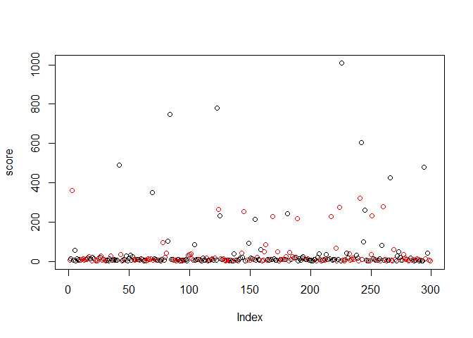
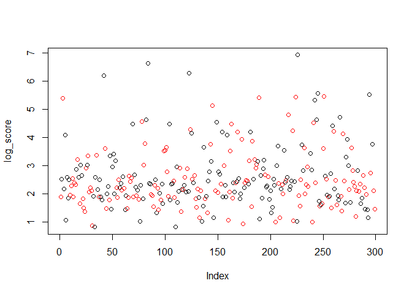
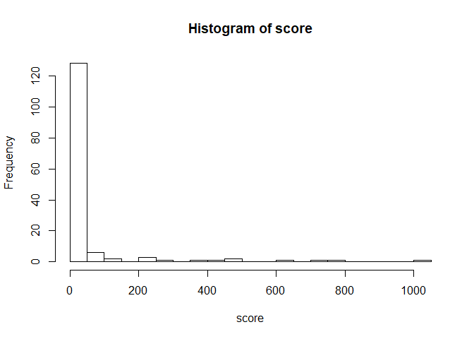
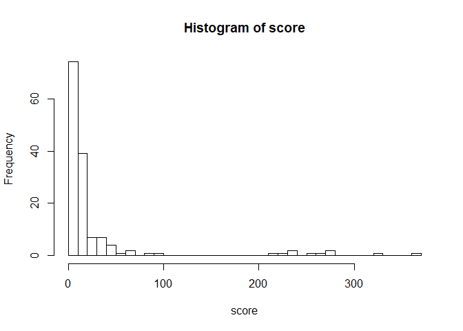

Team mTurk - Image Bounding Scoring
================

``` r
# Read in the correct bounding cooridinates
pilot_d <- fread("../data/experiment_2/experiment_2_results.csv")
pilot_d[, log_bounding_box_score := log(bounding_box_score)]


head(pilot_d)
```

    ##    top bottom right left                          HITId
    ## 1: 435    578   544  152 37SDSEDIOCKDFHIRHX0KAUZPJK081M
    ## 2: 428    579   545  146 37SDSEDIOCKDFHIRHX0KAUZPJK081M
    ## 3: 405    595   556  135 37SDSEDIOCKDFHIRHX0KAUZPJK081M
    ## 4: 385    622   584  120 37SDSEDIOCKDFHIRHX0KAUZPJK081M
    ## 5: 425    580   543  146 37SDSEDIOCKDFHIRHX0KAUZPJK081M
    ## 6: 416    577   546  145 37SDSEDIOCKDFHIRHX0KAUZPJK081M
    ##                         HITTypeId Reward AssignmentDurationInSeconds
    ## 1: 3VMQHMXNFYY535P7V0MRNN4HN3BPRU  $0.20                        3600
    ## 2: 3VMQHMXNFYY535P7V0MRNN4HN3BPRU  $0.20                        3600
    ## 3: 3VMQHMXNFYY535P7V0MRNN4HN3BPRU  $0.20                        3600
    ## 4: 3VMQHMXNFYY535P7V0MRNN4HN3BPRU  $0.20                        3600
    ## 5: 3VMQHMXNFYY535P7V0MRNN4HN3BPRU  $0.20                        3600
    ## 6: 3VMQHMXNFYY535P7V0MRNN4HN3BPRU  $0.20                        3600
    ##          WorkerId AssignmentStatus LifetimeApprovalRate
    ## 1: A182N7RLXGSCZG        Submitted             0% (0/0)
    ## 2: A1LITXPXO6OBB8        Submitted             0% (0/0)
    ## 3:  A2OP2ZANIM5ZV        Submitted             0% (0/0)
    ## 4: A21XECECA39A7I        Submitted             0% (0/0)
    ## 5: A2OFJ6VNONYVK7        Submitted             0% (0/0)
    ## 6: A10BX5AD14TGMB        Submitted             0% (0/0)
    ##    Last30DaysApprovalRate Last7DaysApprovalRate WorkTimeInSeconds
    ## 1:               0% (0/0)              0% (0/0)                45
    ## 2:               0% (0/0)              0% (0/0)                70
    ## 3:               0% (0/0)              0% (0/0)               103
    ## 4:               0% (0/0)              0% (0/0)               108
    ## 5:               0% (0/0)              0% (0/0)               109
    ## 6:               0% (0/0)              0% (0/0)               114
    ##    cellphone tablet smalllaptop midsize largescreen notsure q01.didbf
    ## 1:         0      0           0       0           1       0        no
    ## 2:         0      0           0       1           0       0        no
    ## 3:         0      0           0       1           0       0       yes
    ## 4:         0      0           1       0           0       0     noans
    ## 5:         0      0           0       1           0       0       yes
    ## 6:         0      0           0       1           0       0       yes
    ##    q02.monitor q03.mousetrackpad q04.age q05.income         q06.edu
    ## 1: largescreen             mouse  31to40 gt60klt90k fouryearcollege
    ## 2:     midsize          trackpad  21to30 10ktolt30k fouryearcollege
    ## 3:     midsize             mouse  21to30 10ktolt30k fouryearcollege
    ## 4: smalllaptop             mouse  21to30 gt30klt60k fouryearcollege
    ## 5:     midsize          trackpad  21to30 10ktolt30k      highschool
    ## 6:     midsize             mouse  21to30 gt30klt60k fouryearcollege
    ##                                                                              ImageId
    ## 1: https://kstonedev.s3-us-west-2.amazonaws.com/W241/openimages/116257e7260fdb51.jpg
    ## 2: https://kstonedev.s3-us-west-2.amazonaws.com/W241/openimages/116257e7260fdb51.jpg
    ## 3: https://kstonedev.s3-us-west-2.amazonaws.com/W241/openimages/116257e7260fdb51.jpg
    ## 4: https://kstonedev.s3-us-west-2.amazonaws.com/W241/openimages/116257e7260fdb51.jpg
    ## 5: https://kstonedev.s3-us-west-2.amazonaws.com/W241/openimages/116257e7260fdb51.jpg
    ## 6: https://kstonedev.s3-us-west-2.amazonaws.com/W241/openimages/116257e7260fdb51.jpg
    ##    in_treatment bound_size bounding_box_score log_bounding_box_score
    ## 1:            0   63188.64          20.164618               3.003929
    ## 2:            0   63188.64           7.328206               1.991731
    ## 3:            0   63188.64          38.443185               3.649181
    ## 4:            0   63188.64         102.597284               4.630811
    ## 5:            0   63188.64           4.743881               1.556856
    ## 6:            0   63188.64          12.437924               2.520750

``` r
worker_mean_score <- pilot_d[, .(score = mean(bounding_box_score), log_score = mean(log_bounding_box_score), in_treatment = as.integer(median(in_treatment))), keyby=WorkerId]

worker_mean_score[, plot(score, col=(in_treatment+1))]
```

<!-- -->

    ## NULL

``` r
worker_mean_score[, plot(log_score, col=c("black", "red")[in_treatment+1])]
```

<!-- -->

    ## NULL

``` r
worker_mean_score[in_treatment==0, hist(score, breaks=30)]
```

<!-- -->

    ## $breaks
    ##  [1]    0   50  100  150  200  250  300  350  400  450  500  550  600  650
    ## [15]  700  750  800  850  900  950 1000 1050
    ## 
    ## $counts
    ##  [1] 128   6   2   0   3   1   0   1   1   2   0   0   1   0   1   1   0
    ## [18]   0   0   0   1
    ## 
    ## $density
    ##  [1] 0.0172972973 0.0008108108 0.0002702703 0.0000000000 0.0004054054
    ##  [6] 0.0001351351 0.0000000000 0.0001351351 0.0001351351 0.0002702703
    ## [11] 0.0000000000 0.0000000000 0.0001351351 0.0000000000 0.0001351351
    ## [16] 0.0001351351 0.0000000000 0.0000000000 0.0000000000 0.0000000000
    ## [21] 0.0001351351
    ## 
    ## $mids
    ##  [1]   25   75  125  175  225  275  325  375  425  475  525  575  625  675
    ## [15]  725  775  825  875  925  975 1025
    ## 
    ## $xname
    ## [1] "score"
    ## 
    ## $equidist
    ## [1] TRUE
    ## 
    ## attr(,"class")
    ## [1] "histogram"

``` r
worker_mean_score[in_treatment==1, hist(score, breaks=30)]
```

<!-- -->

    ## $breaks
    ##  [1]   0  10  20  30  40  50  60  70  80  90 100 110 120 130 140 150 160
    ## [18] 170 180 190 200 210 220 230 240 250 260 270 280 290 300 310 320 330
    ## [35] 340 350 360 370
    ## 
    ## $counts
    ##  [1] 74 39  7  7  4  1  2  0  1  1  0  0  0  0  0  0  0  0  0  0  0  1  1
    ## [24]  2  0  1  1  2  0  0  0  0  1  0  0  0  1
    ## 
    ## $density
    ##  [1] 0.0506849315 0.0267123288 0.0047945205 0.0047945205 0.0027397260
    ##  [6] 0.0006849315 0.0013698630 0.0000000000 0.0006849315 0.0006849315
    ## [11] 0.0000000000 0.0000000000 0.0000000000 0.0000000000 0.0000000000
    ## [16] 0.0000000000 0.0000000000 0.0000000000 0.0000000000 0.0000000000
    ## [21] 0.0000000000 0.0006849315 0.0006849315 0.0013698630 0.0000000000
    ## [26] 0.0006849315 0.0006849315 0.0013698630 0.0000000000 0.0000000000
    ## [31] 0.0000000000 0.0000000000 0.0006849315 0.0000000000 0.0000000000
    ## [36] 0.0000000000 0.0006849315
    ## 
    ## $mids
    ##  [1]   5  15  25  35  45  55  65  75  85  95 105 115 125 135 145 155 165
    ## [18] 175 185 195 205 215 225 235 245 255 265 275 285 295 305 315 325 335
    ## [35] 345 355 365
    ## 
    ## $xname
    ## [1] "score"
    ## 
    ## $equidist
    ## [1] TRUE
    ## 
    ## attr(,"class")
    ## [1] "histogram"

``` r
summary(pilot_d[, .(bounding_box_score)])
```

    ##  bounding_box_score
    ##  Min.   :   2.250  
    ##  1st Qu.:   6.654  
    ##  Median :  10.518  
    ##  Mean   :  72.299  
    ##  3rd Qu.:  20.622  
    ##  Max.   :1622.681  
    ##  NA's   :5

``` r
pilot_d[, mean(bounding_box_score, na.rm=T), keyby=in_treatment]
```

    ##    in_treatment       V1
    ## 1:            0 96.70904
    ## 2:            1 47.11207

``` r
#mod <- pilot_d[bounding_box_score < 50, lm(bounding_box_score ~ in_treatment+bound_size)]
mod <- pilot_d[, lm(bounding_box_score ~ in_treatment)]
summary(mod)
```

    ## 
    ## Call:
    ## lm(formula = bounding_box_score ~ in_treatment)
    ## 
    ## Residuals:
    ##     Min      1Q  Median      3Q     Max 
    ##  -94.46  -86.02  -42.33  -34.33 1525.97 
    ## 
    ## Coefficients:
    ##              Estimate Std. Error t value Pr(>|t|)    
    ## (Intercept)     96.71      15.96   6.061 3.84e-09 ***
    ## in_treatment   -49.60      22.74  -2.181   0.0299 *  
    ## ---
    ## Signif. codes:  0 '***' 0.001 '**' 0.01 '*' 0.05 '.' 0.1 ' ' 1
    ## 
    ## Residual standard error: 203.1 on 317 degrees of freedom
    ##   (5 observations deleted due to missingness)
    ## Multiple R-squared:  0.01478,    Adjusted R-squared:  0.01167 
    ## F-statistic: 4.755 on 1 and 317 DF,  p-value: 0.02995

``` r
#t.test(pilot_d[in_treatment == 1, bounding_box_score], pilot_d[in_treatment == 0, bounding_box_score])
```

``` r
mod <- pilot_d[, lm(bounding_box_score ~ in_treatment+as.factor(q02.monitor))]
summary(mod)
```

    ## 
    ## Call:
    ## lm(formula = bounding_box_score ~ in_treatment + as.factor(q02.monitor))
    ## 
    ## Residuals:
    ##     Min      1Q  Median      3Q     Max 
    ## -613.96  -53.78  -39.54  -10.68 1121.80 
    ## 
    ## Coefficients:
    ##                                   Estimate Std. Error t value Pr(>|t|)    
    ## (Intercept)                        53.5232    67.0366   0.798    0.425    
    ## in_treatment                       -9.6775    19.9864  -0.484    0.629    
    ## as.factor(q02.monitor)largescreen -29.6643    69.1845  -0.429    0.668    
    ## as.factor(q02.monitor)midsize      16.5101    67.1616   0.246    0.806    
    ## as.factor(q02.monitor)noans       597.0175    84.9939   7.024 1.36e-11 ***
    ## as.factor(q02.monitor)notsure     -39.3627   108.7019  -0.362    0.718    
    ## as.factor(q02.monitor)smalllaptop   0.2852    68.7994   0.004    0.997    
    ## as.factor(q02.monitor)tablet       30.1536    76.5519   0.394    0.694    
    ## ---
    ## Signif. codes:  0 '***' 0.001 '**' 0.01 '*' 0.05 '.' 0.1 ' ' 1
    ## 
    ## Residual standard error: 173.3 on 311 degrees of freedom
    ##   (5 observations deleted due to missingness)
    ## Multiple R-squared:  0.2963, Adjusted R-squared:  0.2804 
    ## F-statistic:  18.7 on 7 and 311 DF,  p-value: < 2.2e-16

``` r
mod <- pilot_d[, lm(bounding_box_score ~ in_treatment+as.factor(q03.mousetrackpad))]
summary(mod)
```

    ## 
    ## Call:
    ## lm(formula = bounding_box_score ~ in_treatment + as.factor(q03.mousetrackpad))
    ## 
    ## Residuals:
    ##     Min      1Q  Median      3Q     Max 
    ## -368.07  -59.13  -30.65  -20.74 1246.65 
    ## 
    ## Coefficients:
    ##                                      Estimate Std. Error t value Pr(>|t|)
    ## (Intercept)                             68.64      15.76   4.356 1.80e-05
    ## in_treatment                           -34.88      21.42  -1.629    0.104
    ## as.factor(q03.mousetrackpad)noans      307.39      44.23   6.950 2.12e-11
    ## as.factor(q03.mousetrackpad)other      -29.25     190.61  -0.153    0.878
    ## as.factor(q03.mousetrackpad)trackpad    18.74      37.72   0.497    0.620
    ##                                         
    ## (Intercept)                          ***
    ## in_treatment                            
    ## as.factor(q03.mousetrackpad)noans    ***
    ## as.factor(q03.mousetrackpad)other       
    ## as.factor(q03.mousetrackpad)trackpad    
    ## ---
    ## Signif. codes:  0 '***' 0.001 '**' 0.01 '*' 0.05 '.' 0.1 ' ' 1
    ## 
    ## Residual standard error: 190 on 314 degrees of freedom
    ##   (5 observations deleted due to missingness)
    ## Multiple R-squared:  0.1463, Adjusted R-squared:  0.1354 
    ## F-statistic: 13.45 on 4 and 314 DF,  p-value: 3.962e-10

``` r
mod <- pilot_d[, lm(bounding_box_score ~ WorkTimeInSeconds)]
summary(mod)
```

    ## 
    ## Call:
    ## lm(formula = bounding_box_score ~ WorkTimeInSeconds)
    ## 
    ## Residuals:
    ##     Min      1Q  Median      3Q     Max 
    ## -132.41  -61.05  -55.93  -47.18 1536.24 
    ## 
    ## Coefficients:
    ##                   Estimate Std. Error t value Pr(>|t|)    
    ## (Intercept)       60.93780   13.83188   4.406 1.44e-05 ***
    ## WorkTimeInSeconds  0.02220    0.01525   1.455    0.147    
    ## ---
    ## Signif. codes:  0 '***' 0.001 '**' 0.01 '*' 0.05 '.' 0.1 ' ' 1
    ## 
    ## Residual standard error: 203.9 on 317 degrees of freedom
    ##   (5 observations deleted due to missingness)
    ## Multiple R-squared:  0.006636,   Adjusted R-squared:  0.003502 
    ## F-statistic: 2.118 on 1 and 317 DF,  p-value: 0.1466

``` r
pilot_d[, mean(WorkTimeInSeconds, na.rm=T), keyby=in_treatment]
```

    ##    in_treatment       V1
    ## 1:            0 632.1963
    ## 2:            1 384.2609

``` r
mod <- pilot_d[, lm(WorkTimeInSeconds ~ in_treatment)]
summary(mod)
```

    ## 
    ## Call:
    ## lm(formula = WorkTimeInSeconds ~ in_treatment)
    ## 
    ## Residuals:
    ##     Min      1Q  Median      3Q     Max 
    ## -594.20 -422.20 -238.76   53.79 2914.80 
    ## 
    ## Coefficients:
    ##              Estimate Std. Error t value Pr(>|t|)    
    ## (Intercept)    632.20      57.62  10.971  < 2e-16 ***
    ## in_treatment  -247.94      81.75  -3.033  0.00262 ** 
    ## ---
    ## Signif. codes:  0 '***' 0.001 '**' 0.01 '*' 0.05 '.' 0.1 ' ' 1
    ## 
    ## Residual standard error: 735.7 on 322 degrees of freedom
    ## Multiple R-squared:  0.02777,    Adjusted R-squared:  0.02476 
    ## F-statistic: 9.199 on 1 and 322 DF,  p-value: 0.002618

``` r
mod <- worker_mean_score[, lm(score ~ in_treatment)]
summary(mod)
```

    ## 
    ## Call:
    ## lm(formula = score ~ in_treatment)
    ## 
    ## Residuals:
    ##    Min     1Q Median     3Q    Max 
    ## -51.53 -43.30 -26.10 -19.01 953.73 
    ## 
    ## Coefficients:
    ##              Estimate Std. Error t value Pr(>|t|)    
    ## (Intercept)    53.777      9.437   5.699 2.95e-08 ***
    ## in_treatment  -22.147     13.391  -1.654   0.0992 .  
    ## ---
    ## Signif. codes:  0 '***' 0.001 '**' 0.01 '*' 0.05 '.' 0.1 ' ' 1
    ## 
    ## Residual standard error: 114.8 on 292 degrees of freedom
    ##   (5 observations deleted due to missingness)
    ## Multiple R-squared:  0.00928,    Adjusted R-squared:  0.005887 
    ## F-statistic: 2.735 on 1 and 292 DF,  p-value: 0.09923

``` r
mod <- worker_mean_score[, lm(score ~ in_treatment)]
summary(mod)
```

    ## 
    ## Call:
    ## lm(formula = score ~ in_treatment)
    ## 
    ## Residuals:
    ##    Min     1Q Median     3Q    Max 
    ## -51.53 -43.30 -26.10 -19.01 953.73 
    ## 
    ## Coefficients:
    ##              Estimate Std. Error t value Pr(>|t|)    
    ## (Intercept)    53.777      9.437   5.699 2.95e-08 ***
    ## in_treatment  -22.147     13.391  -1.654   0.0992 .  
    ## ---
    ## Signif. codes:  0 '***' 0.001 '**' 0.01 '*' 0.05 '.' 0.1 ' ' 1
    ## 
    ## Residual standard error: 114.8 on 292 degrees of freedom
    ##   (5 observations deleted due to missingness)
    ## Multiple R-squared:  0.00928,    Adjusted R-squared:  0.005887 
    ## F-statistic: 2.735 on 1 and 292 DF,  p-value: 0.09923

``` r
pilot_d[, mean(WorkTimeInSeconds)]
```

    ## [1] 508.9938

``` r
pilot_d[, .N, keyby=WorkerId]
```

    ##            WorkerId N
    ##   1: A10463CXXO00VE 1
    ##   2: A10BX5AD14TGMB 1
    ##   3: A10NBQP7W50X1I 2
    ##   4: A11318F9PB5FFY 1
    ##   5: A119XB4OETWU59 1
    ##  ---                 
    ## 295:  AZ1FVSE3Q101W 1
    ## 296:   AZ6VY1EDA2WF 1
    ## 297:  AZFHBOI9IHMK4 1
    ## 298:  AZH91RXTSG1NZ 1
    ## 299:  AZMJHIX05LZ7D 1

``` r
pilot_d[, sum(in_treatment)]
```

    ## [1] 161

``` r
pilot_d[, mean(bounding_box_score), keyby=ImageId]
```

    ##                                                                              ImageId
    ## 1: https://kstonedev.s3-us-west-2.amazonaws.com/W241/openimages/116257e7260fdb51.jpg
    ##    V1
    ## 1: NA

``` r
pilot_d[, .N, keyby=WorkerId]
```

    ##            WorkerId N
    ##   1: A10463CXXO00VE 1
    ##   2: A10BX5AD14TGMB 1
    ##   3: A10NBQP7W50X1I 2
    ##   4: A11318F9PB5FFY 1
    ##   5: A119XB4OETWU59 1
    ##  ---                 
    ## 295:  AZ1FVSE3Q101W 1
    ## 296:   AZ6VY1EDA2WF 1
    ## 297:  AZFHBOI9IHMK4 1
    ## 298:  AZH91RXTSG1NZ 1
    ## 299:  AZMJHIX05LZ7D 1

``` r
mod <- pilot_d[(in_treatment==0 & bounding_box_score < 600) | in_treatment==1, lm(bounding_box_score ~ in_treatment+bound_size)]
summary(mod)
```

    ## 
    ## Call:
    ## lm(formula = bounding_box_score ~ in_treatment + bound_size)
    ## 
    ## Residuals:
    ##    Min     1Q Median     3Q    Max 
    ## -44.72 -37.67 -32.90 -23.39 605.02 
    ## 
    ## Coefficients: (1 not defined because of singularities)
    ##              Estimate Std. Error t value Pr(>|t|)    
    ## (Intercept)    40.658      8.924   4.556 7.52e-06 ***
    ## in_treatment    6.454     12.540   0.515    0.607    
    ## bound_size         NA         NA      NA       NA    
    ## ---
    ## Signif. codes:  0 '***' 0.001 '**' 0.01 '*' 0.05 '.' 0.1 ' ' 1
    ## 
    ## Residual standard error: 110.4 on 308 degrees of freedom
    ##   (4 observations deleted due to missingness)
    ## Multiple R-squared:  0.0008593,  Adjusted R-squared:  -0.002385 
    ## F-statistic: 0.2649 on 1 and 308 DF,  p-value: 0.6072
