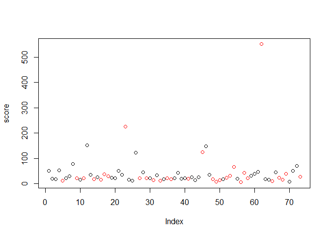
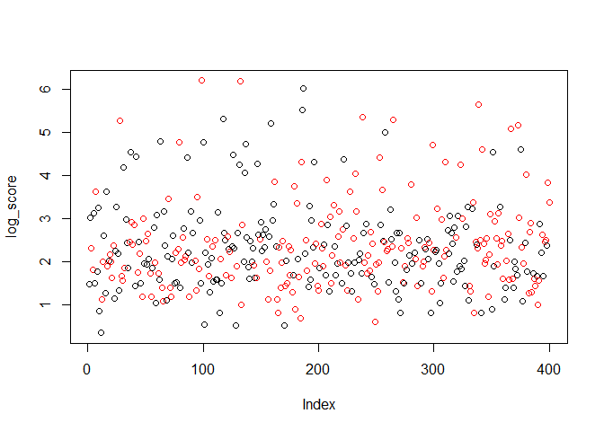

Team mTurk - Image Bounding Scoring
================

``` r
# Read in the correct bounding cooridinates
pilot_d <- fread("../data/pilot_2/pilot2_results.csv")

# Remove bad image where bounding box not available
pilot_d <- pilot_d[ImageId != "https://kstonedev.s3-us-west-2.amazonaws.com/W241/openimages/104b3a47edc67285.jpg",]
pilot_d <- pilot_d[ImageId != "https://kstonedev.s3-us-west-2.amazonaws.com/W241/openimages/1002f337f91b7932.jpg",]
pilot_d <- pilot_d[ImageId != "https://kstonedev.s3-us-west-2.amazonaws.com/W241/openimages/1271622877a21c47.jpg",]


pilot_d[, log_bounding_box_score := log(bounding_box_score)]


head(pilot_d)
```

    ##    top bottom right left                          HITId
    ## 1: 390    471  1024  856 3EHIMLB7GAHOJS35JM352HFW07IH8C
    ## 2: 394    459  1019  861 3EHIMLB7GAHOJS35JM352HFW07IH8C
    ## 3: 396    459  1024  859 3EHIMLB7GAHOJS35JM352HFW07IH8C
    ## 4: 395    462  1024  857 3EHIMLB7GAHOJS35JM352HFW07IH8C
    ## 5: 392    460  1020  859 3EHIMLB7GAHOJS35JM352HFW07IH8C
    ## 6: 392    474  1024  859 3EHIMLB7GAHOJS35JM352HFW07IH8C
    ##                         HITTypeId Reward AssignmentDurationInSeconds
    ## 1: 3AKE04YHPRJMSFDAM48Z0H4PATIZHQ  $0.02                        3600
    ## 2: 3AKE04YHPRJMSFDAM48Z0H4PATIZHQ  $0.02                        3600
    ## 3: 3AKE04YHPRJMSFDAM48Z0H4PATIZHQ  $0.02                        3600
    ## 4: 3AKE04YHPRJMSFDAM48Z0H4PATIZHQ  $0.02                        3600
    ## 5: 3AKE04YHPRJMSFDAM48Z0H4PATIZHQ  $0.02                        3600
    ## 6: 3AKE04YHPRJMSFDAM48Z0H4PATIZHQ  $0.02                        3600
    ##          WorkerId AssignmentStatus LifetimeApprovalRate
    ## 1: A2AZEEKX5O8J4N        Submitted             0% (0/0)
    ## 2: A2LAE3OM5OQ0WF        Submitted             0% (0/0)
    ## 3: A1ULHXPHPJRQVZ        Submitted             0% (0/0)
    ## 4: A2ZY1BYHGB34W5        Submitted             0% (0/0)
    ## 5:  AJY5G987IRT25        Submitted             0% (0/0)
    ## 6:  AE2N5QUSIL9JE        Submitted             0% (0/0)
    ##    Last30DaysApprovalRate Last7DaysApprovalRate WorkTimeInSeconds
    ## 1:               0% (0/0)              0% (0/0)                83
    ## 2:               0% (0/0)              0% (0/0)                31
    ## 3:               0% (0/0)              0% (0/0)                17
    ## 4:               0% (0/0)              0% (0/0)               251
    ## 5:               0% (0/0)              0% (0/0)                12
    ## 6:               0% (0/0)              0% (0/0)                13
    ##                                                                              ImageId
    ## 1: https://kstonedev.s3-us-west-2.amazonaws.com/W241/openimages/101fa29afd6608fc.jpg
    ## 2: https://kstonedev.s3-us-west-2.amazonaws.com/W241/openimages/101fa29afd6608fc.jpg
    ## 3: https://kstonedev.s3-us-west-2.amazonaws.com/W241/openimages/101fa29afd6608fc.jpg
    ## 4: https://kstonedev.s3-us-west-2.amazonaws.com/W241/openimages/101fa29afd6608fc.jpg
    ## 5: https://kstonedev.s3-us-west-2.amazonaws.com/W241/openimages/101fa29afd6608fc.jpg
    ## 6: https://kstonedev.s3-us-west-2.amazonaws.com/W241/openimages/101fa29afd6608fc.jpg
    ##    in_treatment bound_size bounding_box_score log_bounding_box_score
    ## 1:            0   10923.16           22.61808               3.118750
    ## 2:            0   10923.16           14.08984               2.645454
    ## 3:            0   10923.16           18.94323               2.941447
    ## 4:            0   10923.16           16.76657               2.819387
    ## 5:            0   10923.16           13.13188               2.575043
    ## 6:            0   10923.16           25.11612               3.223510

``` r
worker_mean_score <- pilot_d[, .(score = mean(bounding_box_score), log_score = mean(log_bounding_box_score), in_treatment = as.integer(median(in_treatment))), keyby=WorkerId]

worker_mean_score[, plot(score, col=(in_treatment+1))]
```

<!-- -->

    ## NULL

``` r
worker_mean_score[, plot(log_score, col=c("black", "red")[in_treatment+1])]
```

<!-- -->

    ## NULL

``` r
pilot_d[, mean(bounding_box_score, na.rm=T), keyby=in_treatment]
```

    ##    in_treatment       V1
    ## 1:            0 38.94023
    ## 2:            1 34.83889

``` r
mod <- pilot_d[, lm(bounding_box_score ~ in_treatment+bound_size)]
summary(mod)
```

    ## 
    ## Call:
    ## lm(formula = bounding_box_score ~ in_treatment + bound_size)
    ## 
    ## Residuals:
    ##     Min      1Q  Median      3Q     Max 
    ##  -59.05  -20.12  -11.29    2.02 1139.09 
    ## 
    ## Coefficients:
    ##                Estimate Std. Error t value Pr(>|t|)    
    ## (Intercept)   2.752e+01  5.591e+00   4.921 1.08e-06 ***
    ## in_treatment -3.941e+00  6.227e+00  -0.633 0.527025    
    ## bound_size    1.116e-04  3.367e-05   3.315 0.000965 ***
    ## ---
    ## Signif. codes:  0 '***' 0.001 '**' 0.01 '*' 0.05 '.' 0.1 ' ' 1
    ## 
    ## Residual standard error: 81.55 on 683 degrees of freedom
    ## Multiple R-squared:  0.01645,    Adjusted R-squared:  0.01357 
    ## F-statistic: 5.711 on 2 and 683 DF,  p-value: 0.003469

``` r
#t.test(pilot_d[in_treatment == 1, bounding_box_score], pilot_d[in_treatment == 0, bounding_box_score])
```

``` r
mod <- pilot_d[, lm(bounding_box_score ~ WorkTimeInSeconds)]
summary(mod)
```

    ## 
    ## Call:
    ## lm(formula = bounding_box_score ~ WorkTimeInSeconds)
    ## 
    ## Residuals:
    ##     Min      1Q  Median      3Q     Max 
    ##  -49.89  -21.25  -12.33    2.60 1168.64 
    ## 
    ## Coefficients:
    ##                   Estimate Std. Error t value Pr(>|t|)    
    ## (Intercept)       34.19997    3.82827   8.934   <2e-16 ***
    ## WorkTimeInSeconds  0.01737    0.01420   1.223    0.222    
    ## ---
    ## Signif. codes:  0 '***' 0.001 '**' 0.01 '*' 0.05 '.' 0.1 ' ' 1
    ## 
    ## Residual standard error: 82.08 on 684 degrees of freedom
    ## Multiple R-squared:  0.002182,   Adjusted R-squared:  0.0007235 
    ## F-statistic: 1.496 on 1 and 684 DF,  p-value: 0.2217

``` r
pilot_d[, mean(WorkTimeInSeconds, na.rm=T), keyby=in_treatment]
```

    ##    in_treatment       V1
    ## 1:            0 160.4840
    ## 2:            1 149.1983

``` r
mod <- pilot_d[, lm(WorkTimeInSeconds ~ in_treatment)]
summary(mod)
```

    ## 
    ## Call:
    ## lm(formula = WorkTimeInSeconds ~ in_treatment)
    ## 
    ## Residuals:
    ##     Min      1Q  Median      3Q     Max 
    ## -156.48 -133.48 -109.34   86.98 1409.80 
    ## 
    ## Coefficients:
    ##              Estimate Std. Error t value Pr(>|t|)    
    ## (Intercept)    160.48      11.93  13.454   <2e-16 ***
    ## in_treatment   -11.29      16.87  -0.669    0.504    
    ## ---
    ## Signif. codes:  0 '***' 0.001 '**' 0.01 '*' 0.05 '.' 0.1 ' ' 1
    ## 
    ## Residual standard error: 220.9 on 684 degrees of freedom
    ## Multiple R-squared:  0.000654,   Adjusted R-squared:  -0.0008071 
    ## F-statistic: 0.4476 on 1 and 684 DF,  p-value: 0.5037

``` r
mod <- worker_mean_score[score < 100, lm(score ~ in_treatment)]
summary(mod)
```

    ## 
    ## Call:
    ## lm(formula = score ~ in_treatment)
    ## 
    ## Residuals:
    ##     Min      1Q  Median      3Q     Max 
    ## -22.208 -10.183  -4.351   6.074  47.822 
    ## 
    ## Coefficients:
    ##              Estimate Std. Error t value Pr(>|t|)    
    ## (Intercept)    30.077      2.372  12.679   <2e-16 ***
    ## in_treatment   -8.012      3.669  -2.183   0.0326 *  
    ## ---
    ## Signif. codes:  0 '***' 0.001 '**' 0.01 '*' 0.05 '.' 0.1 ' ' 1
    ## 
    ## Residual standard error: 14.81 on 65 degrees of freedom
    ## Multiple R-squared:  0.06833,    Adjusted R-squared:  0.054 
    ## F-statistic: 4.767 on 1 and 65 DF,  p-value: 0.03262

``` r
pilot_d[, mean(WorkTimeInSeconds)]
```

    ## [1] 154.8411

``` r
pilot_d[, .N, keyby=WorkerId]
```

    ##           WorkerId  N
    ##  1: A10HVCH6Y0N7SJ 32
    ##  2: A10IJ2B94MS2MX  2
    ##  3: A16VLS2Z2GYR29  4
    ##  4: A18WFPSLFV4FKY  2
    ##  5: A1A2NGCC4KVRB8  1
    ##  6: A1FPCIKO68OQ63 10
    ##  7: A1G85JMLZY7B28 29
    ##  8:  A1L89JD0FAS0Q 11
    ##  9: A1LFKPNCX23XN6  8
    ## 10: A1NCO5A4JYHGKQ  4
    ## 11: A1O4AAQX2KCD3N  7
    ## 12: A1QRO7EU8B0J4U  2
    ## 13: A1SM0IKQ4OTSCI  2
    ## 14: A1ULHXPHPJRQVZ  9
    ## 15: A1VMYCTZSIBP5J  2
    ## 16: A1Y0ABOUJUMCWW  9
    ## 17: A1ZJL7Q3MPFYJB  1
    ## 18: A1ZRK6K5JUPJAV  1
    ## 19: A255Z4TRTBZLKV 13
    ## 20: A2848VESF5MRA8  3
    ## 21: A2AI293TGSIILE  5
    ## 22: A2AZEEKX5O8J4N 32
    ## 23: A2D71F0L4OOTPK  3
    ## 24: A2FJ8YQ6VHGD2L 18
    ## 25: A2FZ88OU42EFC8  6
    ## 26: A2G5GGLXD2KSZS 10
    ## 27: A2H75L5IY3FR41 21
    ## 28: A2JKM9ZTUWHVPF 25
    ## 29: A2KFVSJQGOHZN8  6
    ## 30: A2LAE3OM5OQ0WF  2
    ## 31: A2LCRHTK0WQEOM  3
    ## 32: A2RCBXJ6Q5I1C1  2
    ## 33: A2U7U0A4G92GTR  5
    ## 34: A2WTDVHVVORNDU  3
    ## 35: A2Y0G20STAP4DC  3
    ## 36: A2ZD05YZ9CKQ0D  7
    ## 37: A2ZY1BYHGB34W5  8
    ## 38: A2ZZW6KME1FUDU  3
    ## 39: A30DUC2L6BI0D5  7
    ## 40: A30N5H4N4C22N8 11
    ## 41: A359WCYOJEO9IG  3
    ## 42: A3720E38DB4LL7  6
    ## 43: A376RKV87IXIVQ  4
    ## 44: A37WQHTSP4WWK3  6
    ## 45: A39Q5Z2B8IZ59C  1
    ## 46: A3AFGG80UCEYNA 10
    ## 47: A3DB4V3R2RXTKU 25
    ## 48: A3G0UTSYPCMFBU 30
    ## 49: A3JVT6LSQTTKVS  1
    ## 50: A3M3CSJVL61LMM  1
    ## 51: A3NBJ2WSWYJPWY 16
    ## 52: A3OYVZSC9CXE5L  9
    ## 53: A3PGUPNMOU5BPW  1
    ## 54: A3RD75HSSMVHKM 34
    ## 55: A3UXXT6KP7MIRG 27
    ## 56:  A4GXHVTRGW5P8  1
    ## 57:  A67D9ONK3AJZ8  9
    ## 58:  ABBMKMTKDC065 13
    ## 59:  AE2N5QUSIL9JE 34
    ## 60:  AEDNG2VYAA8NX 17
    ## 61:  AFDUTS29O99VG  5
    ## 62:  AG4R08059MUPR  2
    ## 63:  AGJTTK50503VZ  8
    ## 64:  AJY5G987IRT25  8
    ## 65:  ALQOIBJA35DZM  3
    ## 66:  AMMUQ5FYIZ1GQ 26
    ## 67:  AMO9QDNF1R150 16
    ## 68:  AOMFEAWQHU3D8  9
    ## 69:  APSKPVAHS522W  9
    ## 70:  AV1GWUIPHJY7Q  1
    ## 71:  AWITQJV4D1QA4 10
    ## 72:  AXZBVDVY0VM3V  3
    ## 73:  AZIAQJWXTSFUX  6
    ##           WorkerId  N

``` r
pilot_d[, sum(in_treatment)]
```

    ## [1] 343

``` r
pilot_d[, mean(bounding_box_score), keyby=ImageId]
```

    ##                                                                               ImageId
    ##  1: https://kstonedev.s3-us-west-2.amazonaws.com/W241/openimages/101fa29afd6608fc.jpg
    ##  2: https://kstonedev.s3-us-west-2.amazonaws.com/W241/openimages/10496f2878b93ee9.jpg
    ##  3: https://kstonedev.s3-us-west-2.amazonaws.com/W241/openimages/108eeb6df9f6b036.jpg
    ##  4: https://kstonedev.s3-us-west-2.amazonaws.com/W241/openimages/10a170e703878553.jpg
    ##  5: https://kstonedev.s3-us-west-2.amazonaws.com/W241/openimages/10e57672e496cc18.jpg
    ##  6: https://kstonedev.s3-us-west-2.amazonaws.com/W241/openimages/116257e7260fdb51.jpg
    ##  7: https://kstonedev.s3-us-west-2.amazonaws.com/W241/openimages/117c0a56e9f25a6c.jpg
    ##  8: https://kstonedev.s3-us-west-2.amazonaws.com/W241/openimages/118ae565963194f2.jpg
    ##  9: https://kstonedev.s3-us-west-2.amazonaws.com/W241/openimages/11a5ec59de4bf422.jpg
    ## 10: https://kstonedev.s3-us-west-2.amazonaws.com/W241/openimages/11b13f14591a1541.jpg
    ## 11: https://kstonedev.s3-us-west-2.amazonaws.com/W241/openimages/11ca5d6eb7a78462.jpg
    ## 12: https://kstonedev.s3-us-west-2.amazonaws.com/W241/openimages/11cbd39c3b7f1cb0.jpg
    ## 13: https://kstonedev.s3-us-west-2.amazonaws.com/W241/openimages/11cc2d6f28ef43e8.jpg
    ## 14: https://kstonedev.s3-us-west-2.amazonaws.com/W241/openimages/11f2911acdd13dfc.jpg
    ## 15: https://kstonedev.s3-us-west-2.amazonaws.com/W241/openimages/120d043fcfb8d619.jpg
    ## 16: https://kstonedev.s3-us-west-2.amazonaws.com/W241/openimages/1242767b37ed4c77.jpg
    ## 17: https://kstonedev.s3-us-west-2.amazonaws.com/W241/openimages/125dab7404579318.jpg
    ##           V1
    ##  1: 23.43752
    ##  2: 57.50680
    ##  3: 21.35954
    ##  4: 59.79267
    ##  5: 34.99101
    ##  6: 22.49589
    ##  7: 49.26748
    ##  8: 21.90156
    ##  9: 24.11292
    ## 10: 22.94632
    ## 11: 62.44282
    ## 12: 29.64071
    ## 13: 30.22750
    ## 14: 50.01161
    ## 15: 46.93291
    ## 16: 40.96663
    ## 17: 26.97933
