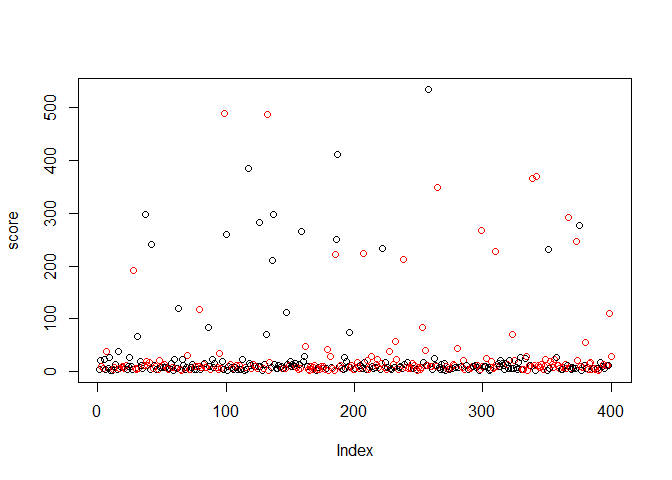

Team mTurk - Image Bounding Scoring
================

``` r
# Read in the correct bounding cooridinates
pilot_d <- fread("../data/pilot_2/pilot2_results.csv")

# Remove bad image where bounding box not available
pilot_d <- pilot_d[ImageId != "https://kstonedev.s3-us-west-2.amazonaws.com/W241/openimages/104b3a47edc67285.jpg",]
pilot_d <- pilot_d[ImageId != "https://kstonedev.s3-us-west-2.amazonaws.com/W241/openimages/1002f337f91b7932.jpg",]
pilot_d <- pilot_d[ImageId != "https://kstonedev.s3-us-west-2.amazonaws.com/W241/openimages/1271622877a21c47.jpg",]


pilot_d[, log_bounding_box_score := log(bounding_box_score)]


head(pilot_d)
```

    ##    top bottom right left                          HITId
    ## 1: 430    584   544  148 3UEBBGULQI623TJCRZGAVOL8HK2FUZ
    ## 2: 433    574   538  150 3UEBBGULQI623TJCRZGAVOL8HK2FUZ
    ## 3: 100    100    85   85 3UEBBGULQI623TJCRZGAVOL8HK2FUZ
    ## 4: 423    586   544  144 3UEBBGULQI623TJCRZGAVOL8HK2FUZ
    ## 5: 292    672   597   85 3UEBBGULQI623TJCRZGAVOL8HK2FUZ
    ## 6: 435    566   541  150 3UEBBGULQI623TJCRZGAVOL8HK2FUZ
    ##                         HITTypeId Reward AssignmentDurationInSeconds
    ## 1: 3U20ZGNLAS4MWP22HDXQICWS88DD74  $0.02                        3600
    ## 2: 3U20ZGNLAS4MWP22HDXQICWS88DD74  $0.02                        3600
    ## 3: 3U20ZGNLAS4MWP22HDXQICWS88DD74  $0.02                        3600
    ## 4: 3U20ZGNLAS4MWP22HDXQICWS88DD74  $0.02                        3600
    ## 5: 3U20ZGNLAS4MWP22HDXQICWS88DD74  $0.02                        3600
    ## 6: 3U20ZGNLAS4MWP22HDXQICWS88DD74  $0.02                        3600
    ##          WorkerId AssignmentStatus LifetimeApprovalRate
    ## 1: A19FU2O520M5Z6        Submitted             0% (0/0)
    ## 2: A3E9YVRNEUB9CA        Submitted             0% (0/0)
    ## 3: A3E9YVRNEUB9CA        Submitted             0% (0/0)
    ## 4:  ASRU3G6U3BH2A        Submitted             0% (0/0)
    ## 5: A2KH641ASLS5P9        Submitted             0% (0/0)
    ## 6: A1QX5V431K1J9Q        Submitted             0% (0/0)
    ##    Last30DaysApprovalRate Last7DaysApprovalRate WorkTimeInSeconds
    ## 1:               0% (0/0)              0% (0/0)                20
    ## 2:               0% (0/0)              0% (0/0)                90
    ## 3:               0% (0/0)              0% (0/0)                90
    ## 4:               0% (0/0)              0% (0/0)               447
    ## 5:               0% (0/0)              0% (0/0)                15
    ## 6:               0% (0/0)              0% (0/0)                46
    ##                                                                              ImageId
    ## 1: https://kstonedev.s3-us-west-2.amazonaws.com/W241/openimages/116257e7260fdb51.jpg
    ## 2: https://kstonedev.s3-us-west-2.amazonaws.com/W241/openimages/116257e7260fdb51.jpg
    ## 3: https://kstonedev.s3-us-west-2.amazonaws.com/W241/openimages/116257e7260fdb51.jpg
    ## 4: https://kstonedev.s3-us-west-2.amazonaws.com/W241/openimages/116257e7260fdb51.jpg
    ## 5: https://kstonedev.s3-us-west-2.amazonaws.com/W241/openimages/116257e7260fdb51.jpg
    ## 6: https://kstonedev.s3-us-west-2.amazonaws.com/W241/openimages/116257e7260fdb51.jpg
    ##    in_treatment bound_size bounding_box_score log_bounding_box_score
    ## 1:            0   63188.64          11.559397               2.447499
    ## 2:            0   63188.64          20.832641               3.036521
    ## 3:            0   63188.64        1046.884077               6.953573
    ## 4:            0   63188.64           6.228059               1.829065
    ## 5:            0   63188.64         250.111445               5.521907
    ## 6:            0   63188.64          27.990564               3.331867

``` r
worker_mean_score <- pilot_d[, .(score = mean(bounding_box_score), log_score = mean(log_bounding_box_score), in_treatment = as.integer(median(in_treatment))), keyby=WorkerId]

worker_mean_score[, plot(score, col=(in_treatment+1))]
```

<!-- -->

    ## NULL

``` r
worker_mean_score[, plot(log_score, col=c("black", "red")[in_treatment+1])]
```

<!-- -->

    ## NULL

``` r
pilot_d[, mean(bounding_box_score, na.rm=T), keyby=in_treatment]
```

    ##    in_treatment       V1
    ## 1:            0 53.40958
    ## 2:            1 63.93677

``` r
mod <- pilot_d[, lm(bounding_box_score ~ in_treatment+bound_size)]
summary(mod)
```

    ## 
    ## Call:
    ## lm(formula = bounding_box_score ~ in_treatment + bound_size)
    ## 
    ## Residuals:
    ##    Min     1Q Median     3Q    Max 
    ## -62.11 -53.79 -47.55 -38.10 993.47 
    ## 
    ## Coefficients: (1 not defined because of singularities)
    ##              Estimate Std. Error t value Pr(>|t|)    
    ## (Intercept)    53.410      9.833   5.432 9.34e-08 ***
    ## in_treatment   10.527     13.859   0.760    0.448    
    ## bound_size         NA         NA      NA       NA    
    ## ---
    ## Signif. codes:  0 '***' 0.001 '**' 0.01 '*' 0.05 '.' 0.1 ' ' 1
    ## 
    ## Residual standard error: 144.5 on 433 degrees of freedom
    ##   (3 observations deleted due to missingness)
    ## Multiple R-squared:  0.001331,   Adjusted R-squared:  -0.0009756 
    ## F-statistic: 0.577 on 1 and 433 DF,  p-value: 0.4479

``` r
#t.test(pilot_d[in_treatment == 1, bounding_box_score], pilot_d[in_treatment == 0, bounding_box_score])
```

``` r
mod <- pilot_d[, lm(bounding_box_score ~ WorkTimeInSeconds)]
summary(mod)
```

    ## 
    ## Call:
    ## lm(formula = bounding_box_score ~ WorkTimeInSeconds)
    ## 
    ## Residuals:
    ##     Min      1Q  Median      3Q     Max 
    ## -239.24  -51.39  -46.51  -36.22  988.00 
    ## 
    ## Coefficients:
    ##                   Estimate Std. Error t value Pr(>|t|)    
    ## (Intercept)       51.79847    7.81791   6.626 1.03e-10 ***
    ## WorkTimeInSeconds  0.07868    0.04173   1.886     0.06 .  
    ## ---
    ## Signif. codes:  0 '***' 0.001 '**' 0.01 '*' 0.05 '.' 0.1 ' ' 1
    ## 
    ## Residual standard error: 144 on 433 degrees of freedom
    ##   (3 observations deleted due to missingness)
    ## Multiple R-squared:  0.008144,   Adjusted R-squared:  0.005853 
    ## F-statistic: 3.555 on 1 and 433 DF,  p-value: 0.06002

``` r
pilot_d[, mean(WorkTimeInSeconds, na.rm=T), keyby=in_treatment]
```

    ##    in_treatment       V1
    ## 1:            0 97.03226
    ## 2:            1 78.97285

``` r
mod <- pilot_d[, lm(WorkTimeInSeconds ~ in_treatment)]
summary(mod)
```

    ## 
    ## Call:
    ## lm(formula = WorkTimeInSeconds ~ in_treatment)
    ## 
    ## Residuals:
    ##     Min      1Q  Median      3Q     Max 
    ##  -88.03  -53.74  -35.97   -0.99 2490.97 
    ## 
    ## Coefficients:
    ##              Estimate Std. Error t value Pr(>|t|)    
    ## (Intercept)     97.03      11.21   8.657   <2e-16 ***
    ## in_treatment   -18.06      15.78  -1.144    0.253    
    ## ---
    ## Signif. codes:  0 '***' 0.001 '**' 0.01 '*' 0.05 '.' 0.1 ' ' 1
    ## 
    ## Residual standard error: 165.1 on 436 degrees of freedom
    ## Multiple R-squared:  0.002995,   Adjusted R-squared:  0.0007084 
    ## F-statistic:  1.31 on 1 and 436 DF,  p-value: 0.2531

``` r
mod <- worker_mean_score[score < 100, lm(score ~ in_treatment)]
summary(mod)
```

    ## 
    ## Call:
    ## lm(formula = score ~ in_treatment)
    ## 
    ## Residuals:
    ##     Min      1Q  Median      3Q     Max 
    ## -10.111  -6.597  -3.344   1.169  71.766 
    ## 
    ## Coefficients:
    ##              Estimate Std. Error t value Pr(>|t|)    
    ## (Intercept)   11.2318     0.8594  13.069   <2e-16 ***
    ## in_treatment   0.7065     1.2154   0.581    0.561    
    ## ---
    ## Signif. codes:  0 '***' 0.001 '**' 0.01 '*' 0.05 '.' 0.1 ' ' 1
    ## 
    ## Residual standard error: 11.63 on 364 degrees of freedom
    ## Multiple R-squared:  0.0009273,  Adjusted R-squared:  -0.001817 
    ## F-statistic: 0.3379 on 1 and 364 DF,  p-value: 0.5614

``` r
pilot_d[, mean(WorkTimeInSeconds)]
```

    ## [1] 87.92009

``` r
pilot_d[, .N, keyby=WorkerId]
```

    ##            WorkerId N
    ##   1: A10XK1PCN65URM 1
    ##   2: A10Y4I2Z2DGF3V 1
    ##   3: A122AII05CFSAP 1
    ##   4: A123PBQDU71I5O 1
    ##   5: A129GA7DAJESE2 1
    ##  ---                 
    ## 396:  AZ5JQK0KGS229 1
    ## 397:  AZ7CL1PR63ATG 1
    ## 398:  AZPJUBGJZ3BT4 1
    ## 399:  AZT19Y8A0811M 2
    ## 400:  AZZDXA6TV6737 1

``` r
pilot_d[, sum(in_treatment)]
```

    ## [1] 221

``` r
pilot_d[, mean(bounding_box_score), keyby=ImageId]
```

    ##                                                                              ImageId
    ## 1: https://kstonedev.s3-us-west-2.amazonaws.com/W241/openimages/116257e7260fdb51.jpg
    ##    V1
    ## 1: NA

``` r
pilot_d[, .N, keyby=WorkerId]
```

    ##            WorkerId N
    ##   1: A10XK1PCN65URM 1
    ##   2: A10Y4I2Z2DGF3V 1
    ##   3: A122AII05CFSAP 1
    ##   4: A123PBQDU71I5O 1
    ##   5: A129GA7DAJESE2 1
    ##  ---                 
    ## 396:  AZ5JQK0KGS229 1
    ## 397:  AZ7CL1PR63ATG 1
    ## 398:  AZPJUBGJZ3BT4 1
    ## 399:  AZT19Y8A0811M 2
    ## 400:  AZZDXA6TV6737 1
