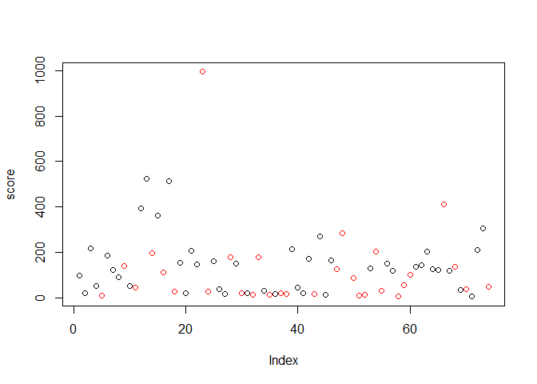
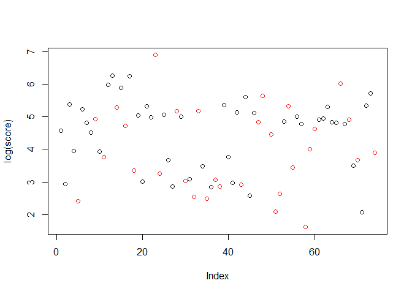
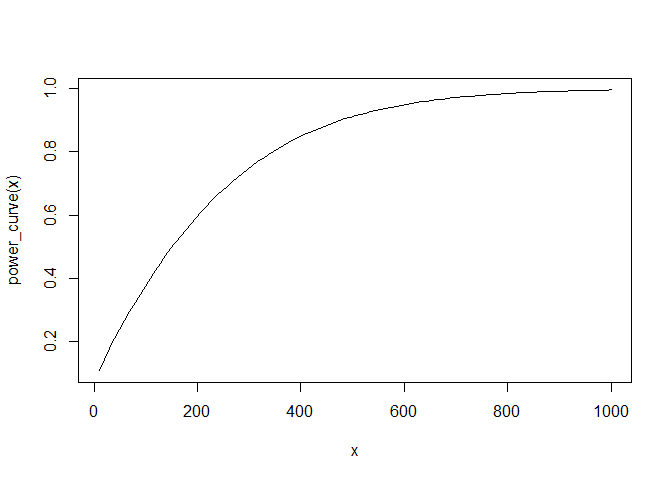
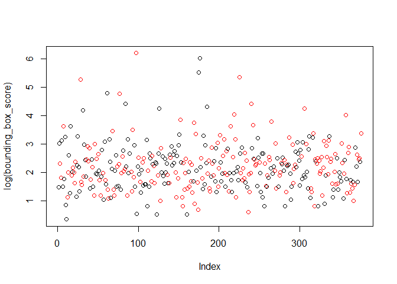

Team mTurk - Image Bounding Scoring
================

Our scoring metric measures the accuracy of the bounding box by
calculating the ucledian distance of the Turkers bounds to the correct
bounding. Therefor a **lower score is better**. When the treatment
should cause a negative reaction, the score should increase if our
hypothesis is correct.

``` r
# Read in all the data, we'll use the 'experiment_no' to pull the results from each experiment. 
d <- fread("./data/experiment_all/experiment_results.csv")
```

``` r
# None of our experiments required creating multiple bounding boxes on a single image.
# We are assuming the extra bounding boxes are mistakes and taking the better score.
remove_extra_bounding_boxes <- function(d) {
  good_scores <- d[,  .(bounding_box_score = min(bounding_box_score), count = .N), keyby=.(WorkerId, ImageId, experiment_no, in_treatment)] %>% .[count<2, ]
  d[good_scores, on=.(WorkerId, ImageId, experiment_no, bounding_box_score, in_treatment)]
}

d <- remove_extra_bounding_boxes(d)
```

# Sanity Check

``` r
d[, .(count=.N, mean_score=mean(bounding_box_score, na.rm=T), std_dev=sd(bounding_box_score, na.rm=T)), keyby=.(experiment_no, is_pilot, in_treatment)]
```

    ##     experiment_no is_pilot in_treatment count mean_score   std_dev
    ##  1:             1        1            0   397  137.60402 295.29711
    ##  2:             1        1            1   396  136.39470 296.29412
    ##  3:             2        1            0   187   15.25847  36.79851
    ##  4:             2        1            1   189   17.09362  42.27343
    ##  5:             3        0            0    48   19.02776  23.08104
    ##  6:             3        0            1    47   22.71446  36.73351
    ##  7:             4        0            0    93   40.35981 139.47131
    ##  8:             4        0            1    94   14.51884  25.36227
    ##  9:             5        0            0    96   13.55187  23.01864
    ## 10:             5        0            1    97   11.61424  11.00214
    ## 11:             6        0            0    94   13.56319  20.70507
    ## 12:             6        0            1    92   13.15357  17.04807

# Experiment 1, our first pilot

For our pilot, we gave the Turkers a negative treatment and asked that
they draw a single bounding box on each of 20 images. We first collected
some information about the subject through a survey and then randomly
assigned those subjects to treatment and control. Our primary goal was
to understand how our scoring scheme worked, gauge level of variance we
should expect in future experiments and test if our covariates collected
from our survey were helpful. We had high attrition and due to a
misunderstanding of the Mechanical Turk platform, our assignments to
treatment and control failed and we ended up with Turkers not in our
experiment in our results, and many ended up in both treatment and
control.

We were not able to trust any ETA, but we could at least see the
variance, which was exceptionally high.

``` r
# Block the results by user taking their mean score
worker_mean_score <- d[experiment_no==1, .(score = mean(bounding_box_score), in_treatment = as.integer(median(in_treatment))), keyby=WorkerId]

worker_mean_score[, plot(score, col=(in_treatment+1))]
```

<!-- -->

    ## NULL

``` r
worker_mean_score[, plot(log(score), col=(in_treatment+1))]
```

<!-- -->

    ## NULL

``` r
summary(worker_mean_score[, .(score)])
```

    ##      score        
    ##  Min.   :  5.003  
    ##  1st Qu.: 25.938  
    ##  Median :119.894  
    ##  Mean   :135.288  
    ##  3rd Qu.:178.160  
    ##  Max.   :994.601  
    ##  NA's   :1

``` r
worker_mean_score[, .(mean_score=mean(score, na.rm=T), std_dev=sd(score, na.rm=T)), keyby=.(in_treatment)]
```

    ##    in_treatment mean_score  std_dev
    ## 1:            0   146.7838 125.4300
    ## 2:            1   118.8101 190.9985

``` r
#e1_mod_1 <- worker_mean_score[, lm(score ~ in_treatment)]
#summary(e1_mod_1)
```

``` r
#TODO Gauge if effort decreases with more HITTs
```

# Experiment 2, our second pilot

With the first pilot behind us, we decided we needed to focus on
increasing our statistical power and hypothesized that having more
subjects with fewer experiments would provide more statistical power.

``` r
d[experiment_no==2, plot(bounding_box_score, col=(in_treatment+1))]
```

<!-- -->

    ## NULL

``` r
d[experiment_no==2, plot(log(bounding_box_score), col=(in_treatment+1))]
```

<!-- -->

    ## NULL

``` r
summary(d[experiment_no==2, .(bounding_box_score)])
```

    ##  bounding_box_score
    ##  Min.   :  1.423   
    ##  1st Qu.:  5.054   
    ##  Median :  8.320   
    ##  Mean   : 16.178   
    ##  3rd Qu.: 13.498   
    ##  Max.   :489.540   
    ##  NA's   :3

``` r
d[experiment_no==2, .(mean_score=mean(bounding_box_score, na.rm=T), std_dev=sd(bounding_box_score, na.rm=T)), keyby=.(in_treatment)]
```

    ##    in_treatment mean_score  std_dev
    ## 1:            0   15.25847 36.79851
    ## 2:            1   17.09362 42.27343

``` r
e2_mod_1 <- d[experiment_no==2, lm(bounding_box_score ~ in_treatment)]
summary(e2_mod_1)
```

    ## 
    ## Call:
    ## lm(formula = bounding_box_score ~ in_treatment)
    ## 
    ## Residuals:
    ##    Min     1Q Median     3Q    Max 
    ## -15.27 -10.80  -7.74  -2.85 472.45 
    ## 
    ## Coefficients:
    ##              Estimate Std. Error t value Pr(>|t|)    
    ## (Intercept)    15.258      2.906   5.250 2.57e-07 ***
    ## in_treatment    1.835      4.105   0.447    0.655    
    ## ---
    ## Signif. codes:  0 '***' 0.001 '**' 0.01 '*' 0.05 '.' 0.1 ' ' 1
    ## 
    ## Residual standard error: 39.64 on 371 degrees of freedom
    ##   (3 observations deleted due to missingness)
    ## Multiple R-squared:  0.0005385,  Adjusted R-squared:  -0.002156 
    ## F-statistic: 0.1999 on 1 and 371 DF,  p-value: 0.6551

Even with a p-value of 0.655, this was progress. Our coeffecient for in
treatment was still more likely due to random noise than not.

# Experiment 3, promis

\#TODO demographic info show how random it is.

``` r
e3_mod_1 <- d[experiment_no==3, lm(bounding_box_score ~ in_treatment)]
summary(e3_mod_1)
```

    ## 
    ## Call:
    ## lm(formula = bounding_box_score ~ in_treatment)
    ## 
    ## Residuals:
    ##     Min      1Q  Median      3Q     Max 
    ## -20.322 -14.375  -9.781  -1.417 197.172 
    ## 
    ## Coefficients:
    ##              Estimate Std. Error t value Pr(>|t|)    
    ## (Intercept)    19.028      4.385   4.339 3.73e-05 ***
    ## in_treatment    3.687      6.340   0.581    0.562    
    ## ---
    ## Signif. codes:  0 '***' 0.001 '**' 0.01 '*' 0.05 '.' 0.1 ' ' 1
    ## 
    ## Residual standard error: 30.38 on 90 degrees of freedom
    ##   (3 observations deleted due to missingness)
    ## Multiple R-squared:  0.003742,   Adjusted R-squared:  -0.007327 
    ## F-statistic: 0.3381 on 1 and 90 DF,  p-value: 0.5624

``` r
e3_mod_2 <- d[experiment_no==3, lm(bounding_box_score ~ in_treatment+as.factor(mousetrackpad))]
summary(e3_mod_2)
```

    ## 
    ## Call:
    ## lm(formula = bounding_box_score ~ in_treatment + as.factor(mousetrackpad))
    ## 
    ## Residuals:
    ##     Min      1Q  Median      3Q     Max 
    ## -22.406 -14.676  -8.505   0.150 195.088 
    ## 
    ## Coefficients:
    ##                                  Estimate Std. Error t value Pr(>|t|)
    ## (Intercept)                         7.435     15.479   0.480    0.632
    ## in_treatment                        4.201      6.334   0.663    0.509
    ## as.factor(mousetrackpad)mouse      13.162     15.522   0.848    0.399
    ## as.factor(mousetrackpad)trackpad   -3.176     18.999  -0.167    0.868
    ## 
    ## Residual standard error: 30.3 on 88 degrees of freedom
    ##   (3 observations deleted due to missingness)
    ## Multiple R-squared:  0.03076,    Adjusted R-squared:  -0.002285 
    ## F-statistic: 0.9308 on 3 and 88 DF,  p-value: 0.4294

# Experiment 4, More data

\#TODO Power calculation

``` r
#e4_mod_1 <- d[experiment_no %in% c(3,4), lm(bounding_box_score ~ in_treatment+as.factor(mousetrackpad)+as.factor(income)+as.factor(age)+as.factor(edu))]
e4_mod_1 <- d[experiment_no %in% c(3,4), lm(bounding_box_score ~ in_treatment)]
summary(e4_mod_1)
```

    ## 
    ## Call:
    ## lm(formula = bounding_box_score ~ in_treatment)
    ## 
    ## Residuals:
    ##    Min     1Q Median     3Q    Max 
    ## -30.80 -23.02 -12.37  -5.59 974.46 
    ## 
    ## Coefficients:
    ##              Estimate Std. Error t value Pr(>|t|)    
    ## (Intercept)    33.046      7.078   4.669 4.74e-06 ***
    ## in_treatment  -15.895     10.064  -1.579    0.115    
    ## ---
    ## Signif. codes:  0 '***' 0.001 '**' 0.01 '*' 0.05 '.' 0.1 ' ' 1
    ## 
    ## Residual standard error: 83.75 on 275 degrees of freedom
    ##   (5 observations deleted due to missingness)
    ## Multiple R-squared:  0.008989,   Adjusted R-squared:  0.005385 
    ## F-statistic: 2.494 on 1 and 275 DF,  p-value: 0.1154

``` r
d[experiment_no %in% c(1), .(sd(bounding_box_score)), keyby=WorkerId]
```

    ##           WorkerId         V1
    ##  1: A10HVCH6Y0N7SJ 235.584000
    ##  2: A10IJ2B94MS2MX   6.479005
    ##  3: A16VLS2Z2GYR29 451.348641
    ##  4: A18WFPSLFV4FKY  10.990759
    ##  5: A1A2NGCC4KVRB8         NA
    ##  6: A1FPCIKO68OQ63 369.866259
    ##  7: A1G85JMLZY7B28 290.648104
    ##  8:  A1L89JD0FAS0Q  51.537902
    ##  9: A1LFKPNCX23XN6 316.547010
    ## 10: A1NCO5A4JYHGKQ  81.725544
    ## 11: A1O4AAQX2KCD3N  63.718816
    ## 12: A1QRO7EU8B0J4U 446.882702
    ## 13: A1SM0IKQ4OTSCI 565.402705
    ## 14: A1ULHXPHPJRQVZ 401.661006
    ## 15: A1VMYCTZSIBP5J 585.616193
    ## 16: A1Y0ABOUJUMCWW 310.157118
    ## 17: A1ZJL7Q3MPFYJB 676.229377
    ## 18: A1ZRK6K5JUPJAV         NA
    ## 19: A255Z4TRTBZLKV 331.045716
    ## 20: A2848VESF5MRA8  16.648456
    ## 21: A2AI293TGSIILE 358.700126
    ## 22: A2AZEEKX5O8J4N 304.610608
    ## 23: A2CPJ227RHJRRZ         NA
    ## 24: A2D71F0L4OOTPK         NA
    ## 25: A2FJ8YQ6VHGD2L 351.252108
    ## 26: A2FZ88OU42EFC8  70.061986
    ## 27: A2G5GGLXD2KSZS  10.109615
    ## 28: A2H75L5IY3FR41 362.377652
    ## 29: A2JKM9ZTUWHVPF 293.844627
    ## 30: A2KFVSJQGOHZN8  10.180322
    ## 31: A2LAE3OM5OQ0WF  11.163816
    ## 32: A2LCRHTK0WQEOM   3.498984
    ## 33: A2MT0EBEHD9XGZ         NA
    ## 34: A2RCBXJ6Q5I1C1  22.056049
    ## 35: A2U7U0A4G92GTR   4.923758
    ## 36: A2WTDVHVVORNDU  13.112159
    ## 37: A2Y0G20STAP4DC  12.744619
    ## 38: A2ZD05YZ9CKQ0D   8.485997
    ## 39: A2ZY1BYHGB34W5 389.156840
    ## 40: A2ZZW6KME1FUDU   8.210787
    ## 41: A30DUC2L6BI0D5  16.431697
    ## 42: A30N5H4N4C22N8 364.541973
    ## 43: A359WCYOJEO9IG  11.170061
    ## 44: A3720E38DB4LL7 456.456074
    ## 45: A376RKV87IXIVQ   6.218161
    ## 46: A37WQHTSP4WWK3 374.087671
    ## 47: A39Q5Z2B8IZ59C         NA
    ## 48: A3AFGG80UCEYNA 433.162414
    ## 49: A3DB4V3R2RXTKU         NA
    ## 50: A3G0UTSYPCMFBU 239.171525
    ## 51: A3JVT6LSQTTKVS         NA
    ## 52: A3M3CSJVL61LMM         NA
    ## 53: A3NBJ2WSWYJPWY 308.251580
    ## 54: A3OYVZSC9CXE5L 402.858146
    ## 55: A3PGUPNMOU5BPW         NA
    ## 56: A3RD75HSSMVHKM 258.728871
    ## 57: A3UXXT6KP7MIRG 305.447980
    ## 58:  A4GXHVTRGW5P8         NA
    ## 59:  A67D9ONK3AJZ8  38.589711
    ## 60:  ABBMKMTKDC065 244.492321
    ## 61:  AE2N5QUSIL9JE 297.879277
    ## 62:  AEDNG2VYAA8NX 297.475071
    ## 63:  AFDUTS29O99VG 388.238234
    ## 64:  AGJTTK50503VZ 325.134710
    ## 65:  AJY5G987IRT25 325.745990
    ## 66:  ALQOIBJA35DZM 549.816301
    ## 67:  AMMUQ5FYIZ1GQ 248.004421
    ## 68:  AMO9QDNF1R150 311.962373
    ## 69:  AOMFEAWQHU3D8  57.455525
    ## 70:  APSKPVAHS522W  16.796501
    ## 71:  AV1GWUIPHJY7Q         NA
    ## 72:  AWITQJV4D1QA4 374.829027
    ## 73:  AXZBVDVY0VM3V 472.514159
    ## 74:  AZIAQJWXTSFUX  59.492570
    ##           WorkerId         V1

``` r
#e4_mod_1 <- d[experiment_no %in% c(3,4), lm(bounding_box_score ~ in_treatment+as.factor(mousetrackpad)+as.factor(income)+as.factor(age)+as.factor(edu))]
e4_mod_1 <- d[experiment_no %in% c(3,4), lm(bounding_box_score ~ in_treatment+factor(mousetrackpad, exclude=c("")))]
summary(e4_mod_1)
```

    ## 
    ## Call:
    ## lm(formula = bounding_box_score ~ in_treatment + factor(mousetrackpad, 
    ##     exclude = c("")))
    ## 
    ## Residuals:
    ##    Min     1Q Median     3Q    Max 
    ## -60.69 -20.75  -9.76  -2.59 978.98 
    ## 
    ## Coefficients:
    ##                                                Estimate Std. Error t value
    ## (Intercept)                                      28.519      7.343   3.884
    ## in_treatment                                    -14.367     10.197  -1.409
    ## factor(mousetrackpad, exclude = c(""))other      -9.645     83.788  -0.115
    ## factor(mousetrackpad, exclude = c(""))trackpad   34.924     17.224   2.028
    ##                                                Pr(>|t|)    
    ## (Intercept)                                     0.00013 ***
    ## in_treatment                                    0.16002    
    ## factor(mousetrackpad, exclude = c(""))other     0.90845    
    ## factor(mousetrackpad, exclude = c(""))trackpad  0.04360 *  
    ## ---
    ## Signif. codes:  0 '***' 0.001 '**' 0.01 '*' 0.05 '.' 0.1 ' ' 1
    ## 
    ## Residual standard error: 83.46 on 265 degrees of freedom
    ##   (13 observations deleted due to missingness)
    ## Multiple R-squared:  0.0226, Adjusted R-squared:  0.01154 
    ## F-statistic: 2.043 on 3 and 265 DF,  p-value: 0.1083

``` r
e4_mod_1 <- d[experiment_no %in% c(3,4), lm(bounding_box_score ~ in_treatment+factor(monitor, exclude=c("")))]
summary(e4_mod_1)
```

    ## 
    ## Call:
    ## lm(formula = bounding_box_score ~ in_treatment + factor(monitor, 
    ##     exclude = c("")))
    ## 
    ## Residuals:
    ##    Min     1Q Median     3Q    Max 
    ## -82.00 -17.09  -9.69  -1.61 923.25 
    ## 
    ## Coefficients:
    ##                                             Estimate Std. Error t value
    ## (Intercept)                                   54.891     31.747   1.729
    ## in_treatment                                 -11.593      9.947  -1.166
    ## factor(monitor, exclude = c(""))largescreen  -36.873     32.733  -1.126
    ## factor(monitor, exclude = c(""))midsize      -26.643     31.902  -0.835
    ## factor(monitor, exclude = c(""))notsure      -39.773     51.355  -0.774
    ## factor(monitor, exclude = c(""))smalllaptop  -28.512     32.632  -0.874
    ## factor(monitor, exclude = c(""))tablet        29.360     36.186   0.811
    ##                                             Pr(>|t|)  
    ## (Intercept)                                    0.085 .
    ## in_treatment                                   0.245  
    ## factor(monitor, exclude = c(""))largescreen    0.261  
    ## factor(monitor, exclude = c(""))midsize        0.404  
    ## factor(monitor, exclude = c(""))notsure        0.439  
    ## factor(monitor, exclude = c(""))smalllaptop    0.383  
    ## factor(monitor, exclude = c(""))tablet         0.418  
    ## ---
    ## Signif. codes:  0 '***' 0.001 '**' 0.01 '*' 0.05 '.' 0.1 ' ' 1
    ## 
    ## Residual standard error: 81.86 on 269 degrees of freedom
    ##   (6 observations deleted due to missingness)
    ## Multiple R-squared:  0.04634,    Adjusted R-squared:  0.02507 
    ## F-statistic: 2.179 on 6 and 269 DF,  p-value: 0.04535

``` r
e4_mod_1 <- d[experiment_no %in% c(3,4), lm(bounding_box_score ~ in_treatment+factor(didbf, exclude=c("")))]
summary(e4_mod_1)
```

    ## 
    ## Call:
    ## lm(formula = bounding_box_score ~ in_treatment + factor(didbf, 
    ##     exclude = c("")))
    ## 
    ## Residuals:
    ##    Min     1Q Median     3Q    Max 
    ## -33.16 -20.71 -12.33  -3.41 972.09 
    ## 
    ## Coefficients:
    ##                                   Estimate Std. Error t value Pr(>|t|)
    ## (Intercept)                          14.83      20.40   0.727    0.468
    ## in_treatment                        -15.44      10.36  -1.490    0.137
    ## factor(didbf, exclude = c(""))no     10.11      23.37   0.432    0.666
    ## factor(didbf, exclude = c(""))yes    20.58      21.48   0.958    0.339
    ## 
    ## Residual standard error: 83.77 on 265 degrees of freedom
    ##   (13 observations deleted due to missingness)
    ## Multiple R-squared:  0.01231,    Adjusted R-squared:  0.001127 
    ## F-statistic: 1.101 on 3 and 265 DF,  p-value: 0.3493

``` r
e4_mod_1 <- d[experiment_no %in% c(3,4), lm(bounding_box_score ~ in_treatment+factor(age, exclude="noans"))]
summary(e4_mod_1)
```

    ## 
    ## Call:
    ## lm(formula = bounding_box_score ~ in_treatment + factor(age, 
    ##     exclude = "noans"))
    ## 
    ## Residuals:
    ##    Min     1Q Median     3Q    Max 
    ## -35.08 -21.24 -11.82  -4.47 975.93 
    ## 
    ## Coefficients:
    ##                                      Estimate Std. Error t value Pr(>|t|)
    ## (Intercept)                            261.16      83.21   3.139  0.00188
    ## in_treatment                           -15.36      10.08  -1.524  0.12874
    ## factor(age, exclude = "noans")21to30  -229.58      83.57  -2.747  0.00642
    ## factor(age, exclude = "noans")31to40  -223.33      84.13  -2.655  0.00841
    ## factor(age, exclude = "noans")4150    -228.50      85.67  -2.667  0.00811
    ## factor(age, exclude = "noans")lt21    -248.02      88.29  -2.809  0.00533
    ## factor(age, exclude = "noans")over50  -249.11      89.94  -2.770  0.00600
    ##                                        
    ## (Intercept)                          **
    ## in_treatment                           
    ## factor(age, exclude = "noans")21to30 **
    ## factor(age, exclude = "noans")31to40 **
    ## factor(age, exclude = "noans")4150   **
    ## factor(age, exclude = "noans")lt21   **
    ## factor(age, exclude = "noans")over50 **
    ## ---
    ## Signif. codes:  0 '***' 0.001 '**' 0.01 '*' 0.05 '.' 0.1 ' ' 1
    ## 
    ## Residual standard error: 83.21 on 270 degrees of freedom
    ##   (5 observations deleted due to missingness)
    ## Multiple R-squared:  0.03956,    Adjusted R-squared:  0.01822 
    ## F-statistic: 1.854 on 6 and 270 DF,  p-value: 0.08903

``` r
e4_mod_1 <- d[experiment_no %in% c(3,4), lm(bounding_box_score ~ in_treatment+factor(edu, exclude=""))]
summary(e4_mod_1)
```

    ## 
    ## Call:
    ## lm(formula = bounding_box_score ~ in_treatment + factor(edu, 
    ##     exclude = ""))
    ## 
    ## Residuals:
    ##    Min     1Q Median     3Q    Max 
    ## -32.07 -20.46 -12.94  -4.09 973.68 
    ## 
    ## Coefficients:
    ##                                        Estimate Std. Error t value
    ## (Intercept)                             33.8220     8.4698   3.993
    ## in_treatment                           -13.2460    10.2050  -1.298
    ## factor(edu, exclude = "")highschool     -9.9491    21.4380  -0.464
    ## factor(edu, exclude = "")lthighschool  -20.5295    59.3501  -0.346
    ## factor(edu, exclude = "")masterorabove   0.4966    14.6413   0.034
    ## factor(edu, exclude = "")somecollege    -9.6420    12.5140  -0.771
    ##                                        Pr(>|t|)    
    ## (Intercept)                            8.41e-05 ***
    ## in_treatment                              0.195    
    ## factor(edu, exclude = "")highschool       0.643    
    ## factor(edu, exclude = "")lthighschool     0.730    
    ## factor(edu, exclude = "")masterorabove    0.973    
    ## factor(edu, exclude = "")somecollege      0.442    
    ## ---
    ## Signif. codes:  0 '***' 0.001 '**' 0.01 '*' 0.05 '.' 0.1 ' ' 1
    ## 
    ## Residual standard error: 83.38 on 269 degrees of freedom
    ##   (7 observations deleted due to missingness)
    ## Multiple R-squared:  0.01054,    Adjusted R-squared:  -0.007856 
    ## F-statistic: 0.5728 on 5 and 269 DF,  p-value: 0.7208

``` r
e4_mod_1 <- d[experiment_no %in% c(3,4), lm(bounding_box_score ~ in_treatment+factor(income, exclude=""))]
summary(e4_mod_1)
```

    ## 
    ## Call:
    ## lm(formula = bounding_box_score ~ in_treatment + factor(income, 
    ##     exclude = ""))
    ## 
    ## Residuals:
    ##    Min     1Q Median     3Q    Max 
    ## -50.89 -20.11 -10.84   1.30 953.50 
    ## 
    ## Coefficients:
    ##                                        Estimate Std. Error t value
    ## (Intercept)                              20.655      9.943   2.077
    ## in_treatment                            -15.622      9.981  -1.565
    ## factor(income, exclude = "")gt30klt60k   33.347     12.839   2.597
    ## factor(income, exclude = "")gt60klt90k    1.730     15.998   0.108
    ## factor(income, exclude = "")gt90k        14.138     20.109   0.703
    ## factor(income, exclude = "")lt10k         3.463     14.509   0.239
    ##                                        Pr(>|t|)   
    ## (Intercept)                             0.03871 * 
    ## in_treatment                            0.11871   
    ## factor(income, exclude = "")gt30klt60k  0.00991 **
    ## factor(income, exclude = "")gt60klt90k  0.91396   
    ## factor(income, exclude = "")gt90k       0.48262   
    ## factor(income, exclude = "")lt10k       0.81152   
    ## ---
    ## Signif. codes:  0 '***' 0.001 '**' 0.01 '*' 0.05 '.' 0.1 ' ' 1
    ## 
    ## Residual standard error: 82.27 on 269 degrees of freedom
    ##   (7 observations deleted due to missingness)
    ## Multiple R-squared:  0.03686,    Adjusted R-squared:  0.01895 
    ## F-statistic: 2.059 on 5 and 269 DF,  p-value: 0.07089

# Experiment 5, threats don’t work

``` r
e5_mod_1 <- d[experiment_no == 5, lm(bounding_box_score ~ in_treatment)]
summary(e5_mod_1)
```

    ## 
    ## Call:
    ## lm(formula = bounding_box_score ~ in_treatment)
    ## 
    ## Residuals:
    ##     Min      1Q  Median      3Q     Max 
    ## -12.005  -7.388  -4.123   0.854 193.311 
    ## 
    ## Coefficients:
    ##              Estimate Std. Error t value Pr(>|t|)    
    ## (Intercept)    13.552      1.848   7.334 6.38e-12 ***
    ## in_treatment   -1.938      2.606  -0.743    0.458    
    ## ---
    ## Signif. codes:  0 '***' 0.001 '**' 0.01 '*' 0.05 '.' 0.1 ' ' 1
    ## 
    ## Residual standard error: 18.01 on 189 degrees of freedom
    ##   (2 observations deleted due to missingness)
    ## Multiple R-squared:  0.002916,   Adjusted R-squared:  -0.00236 
    ## F-statistic: 0.5527 on 1 and 189 DF,  p-value: 0.4582

# Experiment 6, threats still don’t work

``` r
e6_mod_1 <- d[experiment_no == 6, lm(bounding_box_score ~ in_treatment)]
summary(e6_mod_1)
```

    ## 
    ## Call:
    ## lm(formula = bounding_box_score ~ in_treatment)
    ## 
    ## Residuals:
    ##    Min     1Q Median     3Q    Max 
    ## -12.02  -8.64  -6.39  -1.38 107.83 
    ## 
    ## Coefficients:
    ##              Estimate Std. Error t value Pr(>|t|)    
    ## (Intercept)   13.5632     1.9581   6.927 6.99e-11 ***
    ## in_treatment  -0.4096     2.7842  -0.147    0.883    
    ## ---
    ## Signif. codes:  0 '***' 0.001 '**' 0.01 '*' 0.05 '.' 0.1 ' ' 1
    ## 
    ## Residual standard error: 18.98 on 184 degrees of freedom
    ## Multiple R-squared:  0.0001176,  Adjusted R-squared:  -0.005317 
    ## F-statistic: 0.02164 on 1 and 184 DF,  p-value: 0.8832

``` r
e6_mod_2 <- d[experiment_no %in% c(5,6), lm(bounding_box_score ~ in_treatment+(Reward == "$0.05"))]
summary(e6_mod_2)
```

    ## 
    ## Call:
    ## lm(formula = bounding_box_score ~ in_treatment + (Reward == "$0.05"))
    ## 
    ## Residuals:
    ##     Min      1Q  Median      3Q     Max 
    ## -12.399  -8.042  -5.148  -0.011 193.690 
    ## 
    ## Coefficients:
    ##                       Estimate Std. Error t value Pr(>|t|)    
    ## (Intercept)            13.1730     1.6439   8.013 1.44e-14 ***
    ## in_treatment           -1.1838     1.9033  -0.622    0.534    
    ## Reward == "$0.05"TRUE   0.7731     1.9034   0.406    0.685    
    ## ---
    ## Signif. codes:  0 '***' 0.001 '**' 0.01 '*' 0.05 '.' 0.1 ' ' 1
    ## 
    ## Residual standard error: 18.48 on 374 degrees of freedom
    ##   (2 observations deleted due to missingness)
    ## Multiple R-squared:  0.001484,   Adjusted R-squared:  -0.003855 
    ## F-statistic: 0.278 on 2 and 374 DF,  p-value: 0.7575
