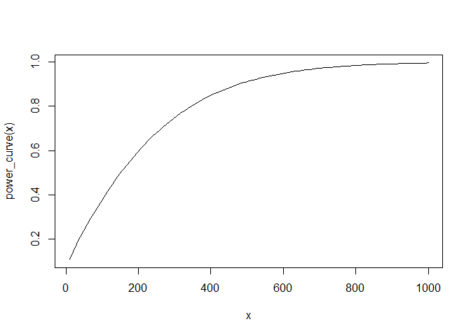
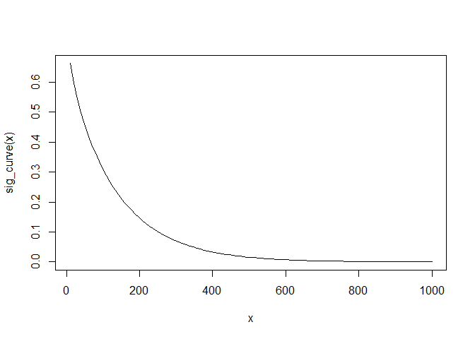

Team mTurk - Image Bounding Scoring
================

Our scoring metric measures the accuracy of the bounding box by
calculating the euclidean distance of the Turkers bounds to the correct
bounding. Therefor a **lower score is better**. When the treatment
should cause a negative reaction, the score should increase if our
hypothesis is correct.

``` r
# Read in all the data, we'll use the 'experiment_no' to pull the results from each experiment. 
d <- fread("./data/experiment_all/experiment_results.csv")
```

``` r
# None of our experiments required creating multiple bounding boxes on a single image.
# We are assuming the extra bounding boxes are mistakes and taking the better score.
remove_extra_bounding_boxes <- function(d) {
  good_scores <- d[,  .(bounding_box_score = min(bounding_box_score), count = .N), keyby=.(WorkerId, ImageId, experiment_no, in_treatment)] %>% .[count<2, ]
  d[good_scores, on=.(WorkerId, ImageId, experiment_no, bounding_box_score, in_treatment)]
}

d <- remove_extra_bounding_boxes(d)
```

# Our Experiments

1: Pilot - Bound 20 images with negative treatment (Government
Surveillance) 2: Pilot - Bound a single image with negative treatment
(Government Surveillance) 3: Experiment - Bound a single image with
positive treatment (Potential future work) 4: Experiment - Increase
subjects for experiment 3 5: Experiment - Bound a single image with
negative treatment, reward 2 cents (Threat of not paying for poor
performance) 6: Experiment - Bound a single image with negative
treatment, increased reward to 5 cents (Threat of not paying for poor
performance)

``` r
d[, .(count=.N, mean_score=mean(bounding_box_score, na.rm=T), std_dev=sd(bounding_box_score, na.rm=T)), keyby=.(experiment_no, is_pilot, in_treatment)]
```

    ##     experiment_no is_pilot in_treatment count mean_score   std_dev
    ##  1:             1        1            0   397  137.60402 295.29711
    ##  2:             1        1            1   396  136.39470 296.29412
    ##  3:             2        1            0   187   15.25847  36.79851
    ##  4:             2        1            1   189   17.09362  42.27343
    ##  5:             3        0            0    48   19.02776  23.08104
    ##  6:             3        0            1    47   22.71446  36.73351
    ##  7:             4        0            0    93   40.35981 139.47131
    ##  8:             4        0            1    94   14.51884  25.36227
    ##  9:             5        0            0    96   13.55187  23.01864
    ## 10:             5        0            1    97   11.61424  11.00214
    ## 11:             6        0            0    94   13.56319  20.70507
    ## 12:             6        0            1    92   13.15357  17.04807

# Experiment 1, our first pilot

For our pilot, we gave the Turkers a negative treatment and asked that
they draw a single bounding box on each of 20 images. We first collected
some information about the subject through a survey and then randomly
assigned those subjects to treatment and control. Our primary goal was
to understand how our scoring scheme worked, gauge level of variance we
should expect in future experiments and test if our covariates collected
from our survey were helpful. We had high attrition and due to a
misunderstanding of the Mechanical Turk platform, our assignments to
treatment and control failed and we ended up with Turkers not in our
experiment in our results, and many ended up in both treatment and
control.

We were not able to trust any ETA, but we could at least see the
variance, which was exceptionally high.

``` r
# Block the results by user taking their mean score
worker_mean_score <- d[experiment_no==1, .(score = mean(bounding_box_score), in_treatment = as.integer(median(in_treatment))), keyby=WorkerId]

worker_mean_score[, plot(score, col=(in_treatment+1))]
```

<!-- -->

    ## NULL

``` r
worker_mean_score[, plot(log(score), col=(in_treatment+1))]
```

<!-- -->

    ## NULL

``` r
summary(worker_mean_score[, .(score)])
```

    ##      score        
    ##  Min.   :  5.003  
    ##  1st Qu.: 25.938  
    ##  Median :119.894  
    ##  Mean   :135.288  
    ##  3rd Qu.:178.160  
    ##  Max.   :994.601  
    ##  NA's   :1

``` r
worker_mean_score[, .(mean_score=mean(score, na.rm=T), std_dev=sd(score, na.rm=T)), keyby=.(in_treatment)]
```

    ##    in_treatment mean_score  std_dev
    ## 1:            0   146.7838 125.4300
    ## 2:            1   118.8101 190.9985

``` r
#e1_mod_1 <- worker_mean_score[, lm(score ~ in_treatment)]
#summary(e1_mod_1)
```

``` r
#TODO Gauge if effort decreases with more HITTs
```

# Experiment 2, our second pilot

With the first pilot behind us, we decided we needed to focus on
increasing our statistical power and hypothesized that having more
subjects with fewer experiments would provide more statistical power.

``` r
d[experiment_no==2, plot(bounding_box_score, col=(in_treatment+1))]
```

<!-- -->

    ## NULL

``` r
d[experiment_no==2, plot(log(bounding_box_score), col=(in_treatment+1))]
```

<!-- -->

    ## NULL

``` r
summary(d[experiment_no==2, .(bounding_box_score)])
```

    ##  bounding_box_score
    ##  Min.   :  1.423   
    ##  1st Qu.:  5.054   
    ##  Median :  8.320   
    ##  Mean   : 16.178   
    ##  3rd Qu.: 13.498   
    ##  Max.   :489.540   
    ##  NA's   :3

``` r
d[experiment_no==2, .(mean_score=mean(bounding_box_score, na.rm=T), std_dev=sd(bounding_box_score, na.rm=T)), keyby=.(in_treatment)]
```

    ##    in_treatment mean_score  std_dev
    ## 1:            0   15.25847 36.79851
    ## 2:            1   17.09362 42.27343

``` r
e2_mod_1 <- d[experiment_no==2, lm(bounding_box_score ~ in_treatment)]
summary(e2_mod_1)
```

    ## 
    ## Call:
    ## lm(formula = bounding_box_score ~ in_treatment)
    ## 
    ## Residuals:
    ##    Min     1Q Median     3Q    Max 
    ## -15.27 -10.80  -7.74  -2.85 472.45 
    ## 
    ## Coefficients:
    ##              Estimate Std. Error t value Pr(>|t|)    
    ## (Intercept)    15.258      2.906   5.250 2.57e-07 ***
    ## in_treatment    1.835      4.105   0.447    0.655    
    ## ---
    ## Signif. codes:  0 '***' 0.001 '**' 0.01 '*' 0.05 '.' 0.1 ' ' 1
    ## 
    ## Residual standard error: 39.64 on 371 degrees of freedom
    ##   (3 observations deleted due to missingness)
    ## Multiple R-squared:  0.0005385,  Adjusted R-squared:  -0.002156 
    ## F-statistic: 0.1999 on 1 and 371 DF,  p-value: 0.6551

Even with a p-value of 0.655, this was progress. Our coefficient for in
treatment was still more likely due to random noise than not.

## Power Test

``` r
e2_eta = d[experiment_no==2 & in_treatment == 1, mean(bounding_box_score, na.rm=T)] - d[experiment_no==2 & in_treatment == 0, mean(bounding_box_score, na.rm=T)]

e2_sd = d[experiment_no==2, sd(bounding_box_score, na.rm=T)]


power.t.test(delta=e2_eta, 
             sd=e2_sd, 
             sig.level = 0.05,
             power = 0.80,
             alternative = "one.sided",
             n = NULL)
```

    ## 
    ##      Two-sample t test power calculation 
    ## 
    ##               n = 5756.986
    ##           delta = 1.835148
    ##              sd = 39.59534
    ##       sig.level = 0.05
    ##           power = 0.8
    ##     alternative = one.sided
    ## 
    ## NOTE: n is number in *each* group

# Experiment 3, promise

\#TODO demographic info show how random it is.

``` r
e3_mod_1 <- d[experiment_no==3, lm(bounding_box_score ~ in_treatment)]
summary(e3_mod_1)
```

    ## 
    ## Call:
    ## lm(formula = bounding_box_score ~ in_treatment)
    ## 
    ## Residuals:
    ##     Min      1Q  Median      3Q     Max 
    ## -20.322 -14.375  -9.781  -1.417 197.172 
    ## 
    ## Coefficients:
    ##              Estimate Std. Error t value Pr(>|t|)    
    ## (Intercept)    19.028      4.385   4.339 3.73e-05 ***
    ## in_treatment    3.687      6.340   0.581    0.562    
    ## ---
    ## Signif. codes:  0 '***' 0.001 '**' 0.01 '*' 0.05 '.' 0.1 ' ' 1
    ## 
    ## Residual standard error: 30.38 on 90 degrees of freedom
    ##   (3 observations deleted due to missingness)
    ## Multiple R-squared:  0.003742,   Adjusted R-squared:  -0.007327 
    ## F-statistic: 0.3381 on 1 and 90 DF,  p-value: 0.5624

``` r
e3_mod_2 <- d[experiment_no==3, lm(bounding_box_score ~ in_treatment+as.factor(mousetrackpad))]
summary(e3_mod_2)
```

    ## 
    ## Call:
    ## lm(formula = bounding_box_score ~ in_treatment + as.factor(mousetrackpad))
    ## 
    ## Residuals:
    ##     Min      1Q  Median      3Q     Max 
    ## -22.406 -14.676  -8.505   0.150 195.088 
    ## 
    ## Coefficients:
    ##                                  Estimate Std. Error t value Pr(>|t|)
    ## (Intercept)                         7.435     15.479   0.480    0.632
    ## in_treatment                        4.201      6.334   0.663    0.509
    ## as.factor(mousetrackpad)mouse      13.162     15.522   0.848    0.399
    ## as.factor(mousetrackpad)trackpad   -3.176     18.999  -0.167    0.868
    ## 
    ## Residual standard error: 30.3 on 88 degrees of freedom
    ##   (3 observations deleted due to missingness)
    ## Multiple R-squared:  0.03076,    Adjusted R-squared:  -0.002285 
    ## F-statistic: 0.9308 on 3 and 88 DF,  p-value: 0.4294

## Power Test

``` r
e3_eta = d[experiment_no==3 & in_treatment == 1, mean(bounding_box_score, na.rm=T)] - d[experiment_no==3 & in_treatment == 0, mean(bounding_box_score, na.rm=T)]

e3_sd = d[experiment_no==3, sd(bounding_box_score, na.rm=T)]


power.t.test(delta=e3_eta, 
             sd=e3_sd, 
             sig.level = 0.05,
             power = 0.80,
             alternative = "one.sided",
             n = NULL)
```

    ## 
    ##      Two-sample t test power calculation 
    ## 
    ##               n = 834.1739
    ##           delta = 3.686703
    ##              sd = 30.26851
    ##       sig.level = 0.05
    ##           power = 0.8
    ##     alternative = one.sided
    ## 
    ## NOTE: n is number in *each* group

# Experiment 4, More data

``` r
e4_mod_1 <- d[experiment_no %in% c(3,4), lm(bounding_box_score ~ in_treatment)]
summary(e4_mod_1)
```

    ## 
    ## Call:
    ## lm(formula = bounding_box_score ~ in_treatment)
    ## 
    ## Residuals:
    ##    Min     1Q Median     3Q    Max 
    ## -30.80 -23.02 -12.37  -5.59 974.46 
    ## 
    ## Coefficients:
    ##              Estimate Std. Error t value Pr(>|t|)    
    ## (Intercept)    33.046      7.078   4.669 4.74e-06 ***
    ## in_treatment  -15.895     10.064  -1.579    0.115    
    ## ---
    ## Signif. codes:  0 '***' 0.001 '**' 0.01 '*' 0.05 '.' 0.1 ' ' 1
    ## 
    ## Residual standard error: 83.75 on 275 degrees of freedom
    ##   (5 observations deleted due to missingness)
    ## Multiple R-squared:  0.008989,   Adjusted R-squared:  0.005385 
    ## F-statistic: 2.494 on 1 and 275 DF,  p-value: 0.1154

``` r
#d[experiment_no %in% c(1), .(sd(bounding_box_score)), keyby=WorkerId]
```

``` r
e4_mod_2 <- d[experiment_no %in% c(3,4), lm(bounding_box_score ~ in_treatment+factor(mousetrackpad, exclude=c("")))]
summary(e4_mod_2)
```

    ## 
    ## Call:
    ## lm(formula = bounding_box_score ~ in_treatment + factor(mousetrackpad, 
    ##     exclude = c("")))
    ## 
    ## Residuals:
    ##    Min     1Q Median     3Q    Max 
    ## -60.69 -20.75  -9.76  -2.59 978.98 
    ## 
    ## Coefficients:
    ##                                                Estimate Std. Error t value
    ## (Intercept)                                      28.519      7.343   3.884
    ## in_treatment                                    -14.367     10.197  -1.409
    ## factor(mousetrackpad, exclude = c(""))other      -9.645     83.788  -0.115
    ## factor(mousetrackpad, exclude = c(""))trackpad   34.924     17.224   2.028
    ##                                                Pr(>|t|)    
    ## (Intercept)                                     0.00013 ***
    ## in_treatment                                    0.16002    
    ## factor(mousetrackpad, exclude = c(""))other     0.90845    
    ## factor(mousetrackpad, exclude = c(""))trackpad  0.04360 *  
    ## ---
    ## Signif. codes:  0 '***' 0.001 '**' 0.01 '*' 0.05 '.' 0.1 ' ' 1
    ## 
    ## Residual standard error: 83.46 on 265 degrees of freedom
    ##   (13 observations deleted due to missingness)
    ## Multiple R-squared:  0.0226, Adjusted R-squared:  0.01154 
    ## F-statistic: 2.043 on 3 and 265 DF,  p-value: 0.1083

``` r
stargazer(e4_mod_1, e4_mod_2, 
          type = 'latex', header = FALSE, table.placement = 'h', 
          add.lines = list(c("Data Subset", "All", "All", "$x==1$")))
```

``` r
e4_mod_3 <- d[experiment_no %in% c(3,4), lm(bounding_box_score ~ in_treatment+factor(monitor, exclude=c("")))]
e4_mod_4 <- d[experiment_no %in% c(3,4), lm(bounding_box_score ~ in_treatment+factor(didbf, exclude=c("")))]
e4_mod_5 <- d[experiment_no %in% c(3,4), lm(bounding_box_score ~ in_treatment+factor(age, exclude="noans"))]
e4_mod_6 <- d[experiment_no %in% c(3,4), lm(bounding_box_score ~ in_treatment+factor(edu, exclude=""))]
e4_mod_7 <- d[experiment_no %in% c(3,4), lm(bounding_box_score ~ in_treatment+factor(income, exclude=""))]

stargazer(e4_mod_3, e4_mod_4, e4_mod_5, e4_mod_6, e4_mod_7,
          type = 'latex', header = FALSE, table.placement = 'h', 
          add.lines = list(c("Data Subset", "All", "All", "$x==1$")))
```

## Power Test

``` r
e4_eta = d[experiment_no %in% c(3, 4) & in_treatment == 1, mean(bounding_box_score, na.rm=T)] - d[experiment_no %in% c(3, 4) & in_treatment == 0, mean(bounding_box_score, na.rm=T)]

e4_sd = d[experiment_no %in% c(3, 4), sd(bounding_box_score, na.rm=T)]


power.t.test(delta=abs(e4_eta), 
             sd=e4_sd, 
             sig.level = 0.05,
             power = 0.80,
             alternative = "one.sided",
             n = NULL)
```

    ## 
    ##      Two-sample t test power calculation 
    ## 
    ##               n = 345.7973
    ##           delta = 15.89495
    ##              sd = 83.97393
    ##       sig.level = 0.05
    ##           power = 0.8
    ##     alternative = one.sided
    ## 
    ## NOTE: n is number in *each* group

``` r
power_curve <- function(x) {
  result = c()

  for (i in 1:length(x)) {
    new_n <- power.t.test(delta=abs(e4_eta), 
             sd=e4_sd, 
             sig.level = 0.05,
             power = NULL,
             alternative = "one.sided",
             n = x[i])["power"]
    
    result <- c(result, new_n)
  }
  
  return(result)
}

sig_curve <- function(x) {
  result = c()

  for (i in 1:length(x)) {
    new_n <- power.t.test(delta=abs(e4_eta), 
             sd=e4_sd, 
             sig.level = NULL,
             power = 0.8,
             alternative = "one.sided",
             n = x[i])["sig.level"]
    
    result <- c(result, new_n)
  }
  
  return(result)
}
curve(power_curve(x), 10, 1000)
```

<!-- -->

``` r
curve(sig_curve(x), 10, 1000)
```

    ## Warning in pt(qt(sig.level/tside, nu, lower.tail = FALSE), nu, ncp
    ## = sqrt(n/tsample) * : full precision may not have been achieved in
    ## 'pnt{final}'
    
    ## Warning in pt(qt(sig.level/tside, nu, lower.tail = FALSE), nu, ncp
    ## = sqrt(n/tsample) * : full precision may not have been achieved in
    ## 'pnt{final}'
    
    ## Warning in pt(qt(sig.level/tside, nu, lower.tail = FALSE), nu, ncp
    ## = sqrt(n/tsample) * : full precision may not have been achieved in
    ## 'pnt{final}'
    
    ## Warning in pt(qt(sig.level/tside, nu, lower.tail = FALSE), nu, ncp
    ## = sqrt(n/tsample) * : full precision may not have been achieved in
    ## 'pnt{final}'
    
    ## Warning in pt(qt(sig.level/tside, nu, lower.tail = FALSE), nu, ncp
    ## = sqrt(n/tsample) * : full precision may not have been achieved in
    ## 'pnt{final}'
    
    ## Warning in pt(qt(sig.level/tside, nu, lower.tail = FALSE), nu, ncp
    ## = sqrt(n/tsample) * : full precision may not have been achieved in
    ## 'pnt{final}'
    
    ## Warning in pt(qt(sig.level/tside, nu, lower.tail = FALSE), nu, ncp
    ## = sqrt(n/tsample) * : full precision may not have been achieved in
    ## 'pnt{final}'
    
    ## Warning in pt(qt(sig.level/tside, nu, lower.tail = FALSE), nu, ncp
    ## = sqrt(n/tsample) * : full precision may not have been achieved in
    ## 'pnt{final}'
    
    ## Warning in pt(qt(sig.level/tside, nu, lower.tail = FALSE), nu, ncp
    ## = sqrt(n/tsample) * : full precision may not have been achieved in
    ## 'pnt{final}'
    
    ## Warning in pt(qt(sig.level/tside, nu, lower.tail = FALSE), nu, ncp
    ## = sqrt(n/tsample) * : full precision may not have been achieved in
    ## 'pnt{final}'
    
    ## Warning in pt(qt(sig.level/tside, nu, lower.tail = FALSE), nu, ncp
    ## = sqrt(n/tsample) * : full precision may not have been achieved in
    ## 'pnt{final}'
    
    ## Warning in pt(qt(sig.level/tside, nu, lower.tail = FALSE), nu, ncp
    ## = sqrt(n/tsample) * : full precision may not have been achieved in
    ## 'pnt{final}'
    
    ## Warning in pt(qt(sig.level/tside, nu, lower.tail = FALSE), nu, ncp
    ## = sqrt(n/tsample) * : full precision may not have been achieved in
    ## 'pnt{final}'
    
    ## Warning in pt(qt(sig.level/tside, nu, lower.tail = FALSE), nu, ncp
    ## = sqrt(n/tsample) * : full precision may not have been achieved in
    ## 'pnt{final}'
    
    ## Warning in pt(qt(sig.level/tside, nu, lower.tail = FALSE), nu, ncp
    ## = sqrt(n/tsample) * : full precision may not have been achieved in
    ## 'pnt{final}'
    
    ## Warning in pt(qt(sig.level/tside, nu, lower.tail = FALSE), nu, ncp
    ## = sqrt(n/tsample) * : full precision may not have been achieved in
    ## 'pnt{final}'
    
    ## Warning in pt(qt(sig.level/tside, nu, lower.tail = FALSE), nu, ncp
    ## = sqrt(n/tsample) * : full precision may not have been achieved in
    ## 'pnt{final}'
    
    ## Warning in pt(qt(sig.level/tside, nu, lower.tail = FALSE), nu, ncp
    ## = sqrt(n/tsample) * : full precision may not have been achieved in
    ## 'pnt{final}'
    
    ## Warning in pt(qt(sig.level/tside, nu, lower.tail = FALSE), nu, ncp
    ## = sqrt(n/tsample) * : full precision may not have been achieved in
    ## 'pnt{final}'
    
    ## Warning in pt(qt(sig.level/tside, nu, lower.tail = FALSE), nu, ncp
    ## = sqrt(n/tsample) * : full precision may not have been achieved in
    ## 'pnt{final}'
    
    ## Warning in pt(qt(sig.level/tside, nu, lower.tail = FALSE), nu, ncp
    ## = sqrt(n/tsample) * : full precision may not have been achieved in
    ## 'pnt{final}'
    
    ## Warning in pt(qt(sig.level/tside, nu, lower.tail = FALSE), nu, ncp
    ## = sqrt(n/tsample) * : full precision may not have been achieved in
    ## 'pnt{final}'
    
    ## Warning in pt(qt(sig.level/tside, nu, lower.tail = FALSE), nu, ncp
    ## = sqrt(n/tsample) * : full precision may not have been achieved in
    ## 'pnt{final}'
    
    ## Warning in pt(qt(sig.level/tside, nu, lower.tail = FALSE), nu, ncp
    ## = sqrt(n/tsample) * : full precision may not have been achieved in
    ## 'pnt{final}'
    
    ## Warning in pt(qt(sig.level/tside, nu, lower.tail = FALSE), nu, ncp
    ## = sqrt(n/tsample) * : full precision may not have been achieved in
    ## 'pnt{final}'
    
    ## Warning in pt(qt(sig.level/tside, nu, lower.tail = FALSE), nu, ncp
    ## = sqrt(n/tsample) * : full precision may not have been achieved in
    ## 'pnt{final}'
    
    ## Warning in pt(qt(sig.level/tside, nu, lower.tail = FALSE), nu, ncp
    ## = sqrt(n/tsample) * : full precision may not have been achieved in
    ## 'pnt{final}'
    
    ## Warning in pt(qt(sig.level/tside, nu, lower.tail = FALSE), nu, ncp
    ## = sqrt(n/tsample) * : full precision may not have been achieved in
    ## 'pnt{final}'
    
    ## Warning in pt(qt(sig.level/tside, nu, lower.tail = FALSE), nu, ncp
    ## = sqrt(n/tsample) * : full precision may not have been achieved in
    ## 'pnt{final}'
    
    ## Warning in pt(qt(sig.level/tside, nu, lower.tail = FALSE), nu, ncp
    ## = sqrt(n/tsample) * : full precision may not have been achieved in
    ## 'pnt{final}'
    
    ## Warning in pt(qt(sig.level/tside, nu, lower.tail = FALSE), nu, ncp
    ## = sqrt(n/tsample) * : full precision may not have been achieved in
    ## 'pnt{final}'
    
    ## Warning in pt(qt(sig.level/tside, nu, lower.tail = FALSE), nu, ncp
    ## = sqrt(n/tsample) * : full precision may not have been achieved in
    ## 'pnt{final}'
    
    ## Warning in pt(qt(sig.level/tside, nu, lower.tail = FALSE), nu, ncp
    ## = sqrt(n/tsample) * : full precision may not have been achieved in
    ## 'pnt{final}'
    
    ## Warning in pt(qt(sig.level/tside, nu, lower.tail = FALSE), nu, ncp
    ## = sqrt(n/tsample) * : full precision may not have been achieved in
    ## 'pnt{final}'
    
    ## Warning in pt(qt(sig.level/tside, nu, lower.tail = FALSE), nu, ncp
    ## = sqrt(n/tsample) * : full precision may not have been achieved in
    ## 'pnt{final}'
    
    ## Warning in pt(qt(sig.level/tside, nu, lower.tail = FALSE), nu, ncp
    ## = sqrt(n/tsample) * : full precision may not have been achieved in
    ## 'pnt{final}'
    
    ## Warning in pt(qt(sig.level/tside, nu, lower.tail = FALSE), nu, ncp
    ## = sqrt(n/tsample) * : full precision may not have been achieved in
    ## 'pnt{final}'
    
    ## Warning in pt(qt(sig.level/tside, nu, lower.tail = FALSE), nu, ncp
    ## = sqrt(n/tsample) * : full precision may not have been achieved in
    ## 'pnt{final}'
    
    ## Warning in pt(qt(sig.level/tside, nu, lower.tail = FALSE), nu, ncp
    ## = sqrt(n/tsample) * : full precision may not have been achieved in
    ## 'pnt{final}'
    
    ## Warning in pt(qt(sig.level/tside, nu, lower.tail = FALSE), nu, ncp
    ## = sqrt(n/tsample) * : full precision may not have been achieved in
    ## 'pnt{final}'
    
    ## Warning in pt(qt(sig.level/tside, nu, lower.tail = FALSE), nu, ncp
    ## = sqrt(n/tsample) * : full precision may not have been achieved in
    ## 'pnt{final}'
    
    ## Warning in pt(qt(sig.level/tside, nu, lower.tail = FALSE), nu, ncp
    ## = sqrt(n/tsample) * : full precision may not have been achieved in
    ## 'pnt{final}'
    
    ## Warning in pt(qt(sig.level/tside, nu, lower.tail = FALSE), nu, ncp
    ## = sqrt(n/tsample) * : full precision may not have been achieved in
    ## 'pnt{final}'
    
    ## Warning in pt(qt(sig.level/tside, nu, lower.tail = FALSE), nu, ncp
    ## = sqrt(n/tsample) * : full precision may not have been achieved in
    ## 'pnt{final}'
    
    ## Warning in pt(qt(sig.level/tside, nu, lower.tail = FALSE), nu, ncp
    ## = sqrt(n/tsample) * : full precision may not have been achieved in
    ## 'pnt{final}'
    
    ## Warning in pt(qt(sig.level/tside, nu, lower.tail = FALSE), nu, ncp
    ## = sqrt(n/tsample) * : full precision may not have been achieved in
    ## 'pnt{final}'
    
    ## Warning in pt(qt(sig.level/tside, nu, lower.tail = FALSE), nu, ncp
    ## = sqrt(n/tsample) * : full precision may not have been achieved in
    ## 'pnt{final}'
    
    ## Warning in pt(qt(sig.level/tside, nu, lower.tail = FALSE), nu, ncp
    ## = sqrt(n/tsample) * : full precision may not have been achieved in
    ## 'pnt{final}'
    
    ## Warning in pt(qt(sig.level/tside, nu, lower.tail = FALSE), nu, ncp
    ## = sqrt(n/tsample) * : full precision may not have been achieved in
    ## 'pnt{final}'
    
    ## Warning in pt(qt(sig.level/tside, nu, lower.tail = FALSE), nu, ncp
    ## = sqrt(n/tsample) * : full precision may not have been achieved in
    ## 'pnt{final}'
    
    ## Warning in pt(qt(sig.level/tside, nu, lower.tail = FALSE), nu, ncp
    ## = sqrt(n/tsample) * : full precision may not have been achieved in
    ## 'pnt{final}'
    
    ## Warning in pt(qt(sig.level/tside, nu, lower.tail = FALSE), nu, ncp
    ## = sqrt(n/tsample) * : full precision may not have been achieved in
    ## 'pnt{final}'
    
    ## Warning in pt(qt(sig.level/tside, nu, lower.tail = FALSE), nu, ncp
    ## = sqrt(n/tsample) * : full precision may not have been achieved in
    ## 'pnt{final}'
    
    ## Warning in pt(qt(sig.level/tside, nu, lower.tail = FALSE), nu, ncp
    ## = sqrt(n/tsample) * : full precision may not have been achieved in
    ## 'pnt{final}'
    
    ## Warning in pt(qt(sig.level/tside, nu, lower.tail = FALSE), nu, ncp
    ## = sqrt(n/tsample) * : full precision may not have been achieved in
    ## 'pnt{final}'
    
    ## Warning in pt(qt(sig.level/tside, nu, lower.tail = FALSE), nu, ncp
    ## = sqrt(n/tsample) * : full precision may not have been achieved in
    ## 'pnt{final}'
    
    ## Warning in pt(qt(sig.level/tside, nu, lower.tail = FALSE), nu, ncp
    ## = sqrt(n/tsample) * : full precision may not have been achieved in
    ## 'pnt{final}'
    
    ## Warning in pt(qt(sig.level/tside, nu, lower.tail = FALSE), nu, ncp
    ## = sqrt(n/tsample) * : full precision may not have been achieved in
    ## 'pnt{final}'
    
    ## Warning in pt(qt(sig.level/tside, nu, lower.tail = FALSE), nu, ncp
    ## = sqrt(n/tsample) * : full precision may not have been achieved in
    ## 'pnt{final}'
    
    ## Warning in pt(qt(sig.level/tside, nu, lower.tail = FALSE), nu, ncp
    ## = sqrt(n/tsample) * : full precision may not have been achieved in
    ## 'pnt{final}'
    
    ## Warning in pt(qt(sig.level/tside, nu, lower.tail = FALSE), nu, ncp
    ## = sqrt(n/tsample) * : full precision may not have been achieved in
    ## 'pnt{final}'
    
    ## Warning in pt(qt(sig.level/tside, nu, lower.tail = FALSE), nu, ncp
    ## = sqrt(n/tsample) * : full precision may not have been achieved in
    ## 'pnt{final}'
    
    ## Warning in pt(qt(sig.level/tside, nu, lower.tail = FALSE), nu, ncp
    ## = sqrt(n/tsample) * : full precision may not have been achieved in
    ## 'pnt{final}'
    
    ## Warning in pt(qt(sig.level/tside, nu, lower.tail = FALSE), nu, ncp
    ## = sqrt(n/tsample) * : full precision may not have been achieved in
    ## 'pnt{final}'
    
    ## Warning in pt(qt(sig.level/tside, nu, lower.tail = FALSE), nu, ncp
    ## = sqrt(n/tsample) * : full precision may not have been achieved in
    ## 'pnt{final}'
    
    ## Warning in pt(qt(sig.level/tside, nu, lower.tail = FALSE), nu, ncp
    ## = sqrt(n/tsample) * : full precision may not have been achieved in
    ## 'pnt{final}'
    
    ## Warning in pt(qt(sig.level/tside, nu, lower.tail = FALSE), nu, ncp
    ## = sqrt(n/tsample) * : full precision may not have been achieved in
    ## 'pnt{final}'
    
    ## Warning in pt(qt(sig.level/tside, nu, lower.tail = FALSE), nu, ncp
    ## = sqrt(n/tsample) * : full precision may not have been achieved in
    ## 'pnt{final}'
    
    ## Warning in pt(qt(sig.level/tside, nu, lower.tail = FALSE), nu, ncp
    ## = sqrt(n/tsample) * : full precision may not have been achieved in
    ## 'pnt{final}'
    
    ## Warning in pt(qt(sig.level/tside, nu, lower.tail = FALSE), nu, ncp
    ## = sqrt(n/tsample) * : full precision may not have been achieved in
    ## 'pnt{final}'
    
    ## Warning in pt(qt(sig.level/tside, nu, lower.tail = FALSE), nu, ncp
    ## = sqrt(n/tsample) * : full precision may not have been achieved in
    ## 'pnt{final}'
    
    ## Warning in pt(qt(sig.level/tside, nu, lower.tail = FALSE), nu, ncp
    ## = sqrt(n/tsample) * : full precision may not have been achieved in
    ## 'pnt{final}'
    
    ## Warning in pt(qt(sig.level/tside, nu, lower.tail = FALSE), nu, ncp
    ## = sqrt(n/tsample) * : full precision may not have been achieved in
    ## 'pnt{final}'
    
    ## Warning in pt(qt(sig.level/tside, nu, lower.tail = FALSE), nu, ncp
    ## = sqrt(n/tsample) * : full precision may not have been achieved in
    ## 'pnt{final}'
    
    ## Warning in pt(qt(sig.level/tside, nu, lower.tail = FALSE), nu, ncp
    ## = sqrt(n/tsample) * : full precision may not have been achieved in
    ## 'pnt{final}'
    
    ## Warning in pt(qt(sig.level/tside, nu, lower.tail = FALSE), nu, ncp
    ## = sqrt(n/tsample) * : full precision may not have been achieved in
    ## 'pnt{final}'
    
    ## Warning in pt(qt(sig.level/tside, nu, lower.tail = FALSE), nu, ncp
    ## = sqrt(n/tsample) * : full precision may not have been achieved in
    ## 'pnt{final}'
    
    ## Warning in pt(qt(sig.level/tside, nu, lower.tail = FALSE), nu, ncp
    ## = sqrt(n/tsample) * : full precision may not have been achieved in
    ## 'pnt{final}'
    
    ## Warning in pt(qt(sig.level/tside, nu, lower.tail = FALSE), nu, ncp
    ## = sqrt(n/tsample) * : full precision may not have been achieved in
    ## 'pnt{final}'
    
    ## Warning in pt(qt(sig.level/tside, nu, lower.tail = FALSE), nu, ncp
    ## = sqrt(n/tsample) * : full precision may not have been achieved in
    ## 'pnt{final}'
    
    ## Warning in pt(qt(sig.level/tside, nu, lower.tail = FALSE), nu, ncp
    ## = sqrt(n/tsample) * : full precision may not have been achieved in
    ## 'pnt{final}'
    
    ## Warning in pt(qt(sig.level/tside, nu, lower.tail = FALSE), nu, ncp
    ## = sqrt(n/tsample) * : full precision may not have been achieved in
    ## 'pnt{final}'
    
    ## Warning in pt(qt(sig.level/tside, nu, lower.tail = FALSE), nu, ncp
    ## = sqrt(n/tsample) * : full precision may not have been achieved in
    ## 'pnt{final}'
    
    ## Warning in pt(qt(sig.level/tside, nu, lower.tail = FALSE), nu, ncp
    ## = sqrt(n/tsample) * : full precision may not have been achieved in
    ## 'pnt{final}'
    
    ## Warning in pt(qt(sig.level/tside, nu, lower.tail = FALSE), nu, ncp
    ## = sqrt(n/tsample) * : full precision may not have been achieved in
    ## 'pnt{final}'
    
    ## Warning in pt(qt(sig.level/tside, nu, lower.tail = FALSE), nu, ncp
    ## = sqrt(n/tsample) * : full precision may not have been achieved in
    ## 'pnt{final}'
    
    ## Warning in pt(qt(sig.level/tside, nu, lower.tail = FALSE), nu, ncp
    ## = sqrt(n/tsample) * : full precision may not have been achieved in
    ## 'pnt{final}'
    
    ## Warning in pt(qt(sig.level/tside, nu, lower.tail = FALSE), nu, ncp
    ## = sqrt(n/tsample) * : full precision may not have been achieved in
    ## 'pnt{final}'
    
    ## Warning in pt(qt(sig.level/tside, nu, lower.tail = FALSE), nu, ncp
    ## = sqrt(n/tsample) * : full precision may not have been achieved in
    ## 'pnt{final}'
    
    ## Warning in pt(qt(sig.level/tside, nu, lower.tail = FALSE), nu, ncp
    ## = sqrt(n/tsample) * : full precision may not have been achieved in
    ## 'pnt{final}'
    
    ## Warning in pt(qt(sig.level/tside, nu, lower.tail = FALSE), nu, ncp
    ## = sqrt(n/tsample) * : full precision may not have been achieved in
    ## 'pnt{final}'
    
    ## Warning in pt(qt(sig.level/tside, nu, lower.tail = FALSE), nu, ncp
    ## = sqrt(n/tsample) * : full precision may not have been achieved in
    ## 'pnt{final}'
    
    ## Warning in pt(qt(sig.level/tside, nu, lower.tail = FALSE), nu, ncp
    ## = sqrt(n/tsample) * : full precision may not have been achieved in
    ## 'pnt{final}'
    
    ## Warning in pt(qt(sig.level/tside, nu, lower.tail = FALSE), nu, ncp
    ## = sqrt(n/tsample) * : full precision may not have been achieved in
    ## 'pnt{final}'
    
    ## Warning in pt(qt(sig.level/tside, nu, lower.tail = FALSE), nu, ncp
    ## = sqrt(n/tsample) * : full precision may not have been achieved in
    ## 'pnt{final}'
    
    ## Warning in pt(qt(sig.level/tside, nu, lower.tail = FALSE), nu, ncp
    ## = sqrt(n/tsample) * : full precision may not have been achieved in
    ## 'pnt{final}'
    
    ## Warning in pt(qt(sig.level/tside, nu, lower.tail = FALSE), nu, ncp
    ## = sqrt(n/tsample) * : full precision may not have been achieved in
    ## 'pnt{final}'
    
    ## Warning in pt(qt(sig.level/tside, nu, lower.tail = FALSE), nu, ncp
    ## = sqrt(n/tsample) * : full precision may not have been achieved in
    ## 'pnt{final}'
    
    ## Warning in pt(qt(sig.level/tside, nu, lower.tail = FALSE), nu, ncp
    ## = sqrt(n/tsample) * : full precision may not have been achieved in
    ## 'pnt{final}'
    
    ## Warning in pt(qt(sig.level/tside, nu, lower.tail = FALSE), nu, ncp
    ## = sqrt(n/tsample) * : full precision may not have been achieved in
    ## 'pnt{final}'
    
    ## Warning in pt(qt(sig.level/tside, nu, lower.tail = FALSE), nu, ncp
    ## = sqrt(n/tsample) * : full precision may not have been achieved in
    ## 'pnt{final}'

<!-- -->

# Experiment 5, threats don’t work

``` r
e5_mod_1 <- d[experiment_no == 5, lm(bounding_box_score ~ in_treatment)]
summary(e5_mod_1)
```

    ## 
    ## Call:
    ## lm(formula = bounding_box_score ~ in_treatment)
    ## 
    ## Residuals:
    ##     Min      1Q  Median      3Q     Max 
    ## -12.005  -7.388  -4.123   0.854 193.311 
    ## 
    ## Coefficients:
    ##              Estimate Std. Error t value Pr(>|t|)    
    ## (Intercept)    13.552      1.848   7.334 6.38e-12 ***
    ## in_treatment   -1.938      2.606  -0.743    0.458    
    ## ---
    ## Signif. codes:  0 '***' 0.001 '**' 0.01 '*' 0.05 '.' 0.1 ' ' 1
    ## 
    ## Residual standard error: 18.01 on 189 degrees of freedom
    ##   (2 observations deleted due to missingness)
    ## Multiple R-squared:  0.002916,   Adjusted R-squared:  -0.00236 
    ## F-statistic: 0.5527 on 1 and 189 DF,  p-value: 0.4582

# Experiment 6, threats still don’t work

``` r
e6_mod_1 <- d[experiment_no == 6, lm(bounding_box_score ~ in_treatment)]
summary(e6_mod_1)
```

    ## 
    ## Call:
    ## lm(formula = bounding_box_score ~ in_treatment)
    ## 
    ## Residuals:
    ##    Min     1Q Median     3Q    Max 
    ## -12.02  -8.64  -6.39  -1.38 107.83 
    ## 
    ## Coefficients:
    ##              Estimate Std. Error t value Pr(>|t|)    
    ## (Intercept)   13.5632     1.9581   6.927 6.99e-11 ***
    ## in_treatment  -0.4096     2.7842  -0.147    0.883    
    ## ---
    ## Signif. codes:  0 '***' 0.001 '**' 0.01 '*' 0.05 '.' 0.1 ' ' 1
    ## 
    ## Residual standard error: 18.98 on 184 degrees of freedom
    ## Multiple R-squared:  0.0001176,  Adjusted R-squared:  -0.005317 
    ## F-statistic: 0.02164 on 1 and 184 DF,  p-value: 0.8832

``` r
e6_mod_2 <- d[experiment_no %in% c(5,6), lm(bounding_box_score ~ in_treatment+(Reward == "$0.05"))]
summary(e6_mod_2)
```

    ## 
    ## Call:
    ## lm(formula = bounding_box_score ~ in_treatment + (Reward == "$0.05"))
    ## 
    ## Residuals:
    ##     Min      1Q  Median      3Q     Max 
    ## -12.399  -8.042  -5.148  -0.011 193.690 
    ## 
    ## Coefficients:
    ##                       Estimate Std. Error t value Pr(>|t|)    
    ## (Intercept)            13.1730     1.6439   8.013 1.44e-14 ***
    ## in_treatment           -1.1838     1.9033  -0.622    0.534    
    ## Reward == "$0.05"TRUE   0.7731     1.9034   0.406    0.685    
    ## ---
    ## Signif. codes:  0 '***' 0.001 '**' 0.01 '*' 0.05 '.' 0.1 ' ' 1
    ## 
    ## Residual standard error: 18.48 on 374 degrees of freedom
    ##   (2 observations deleted due to missingness)
    ## Multiple R-squared:  0.001484,   Adjusted R-squared:  -0.003855 
    ## F-statistic: 0.278 on 2 and 374 DF,  p-value: 0.7575
